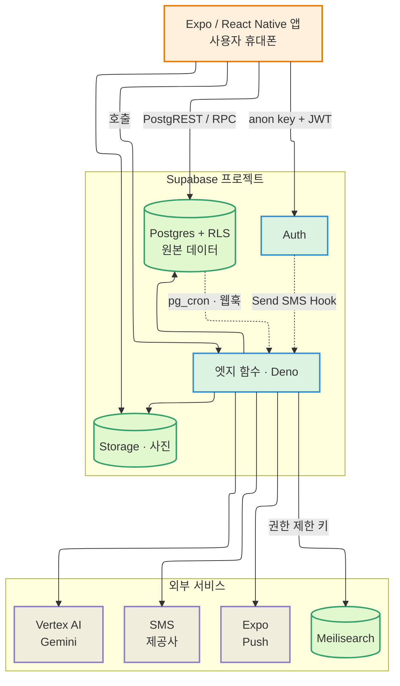
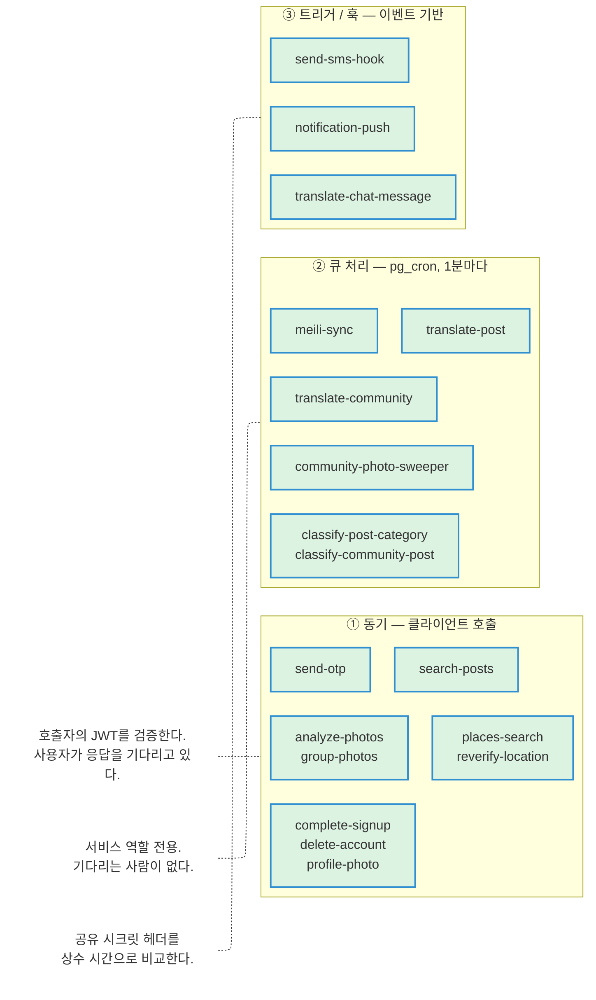
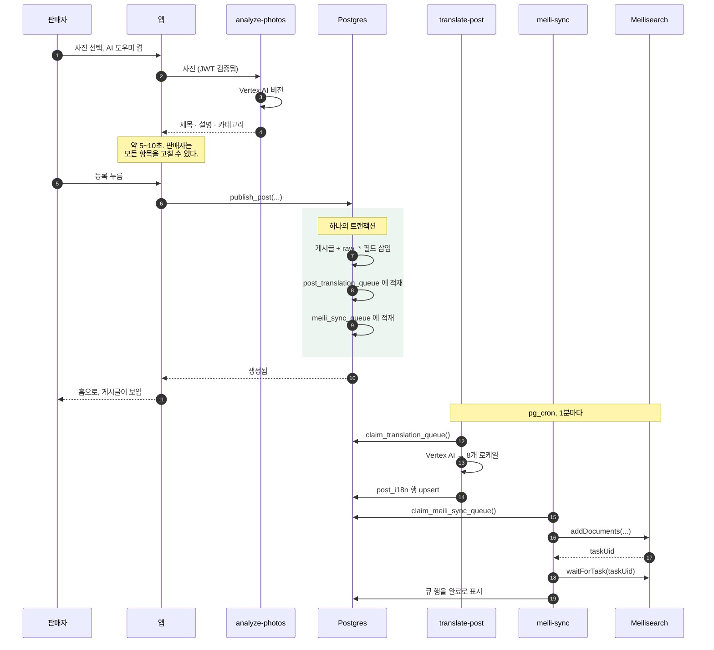
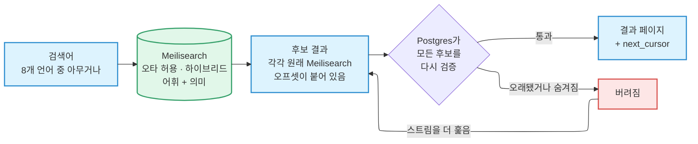
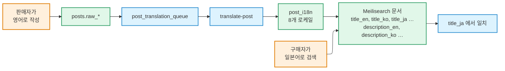
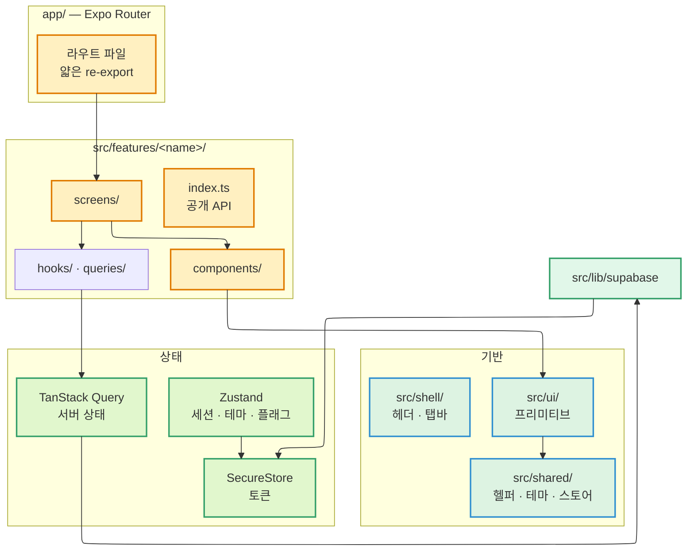

# 아키텍처

PopOut은 **하나의 Expo 애플리케이션**이며, Supabase 백엔드가 같은 저장소 안에
들어 있습니다. 모노레포가 아니라 하나의 앱, 하나의 백엔드, 하나의 배포 흐름입니다.

정작 흥미로운 부분은 상자 그림이 아닙니다. 백엔드가 작업을 **세 가지 서로 다른 호출
모델**로 돌린다는 점, 그리고 검색 읽기 경로가 자기 검색 인덱스를 신뢰하지 않는다는
점입니다. 둘 다 아래에서 다룹니다.

## 시스템 전체 구조

이 그림에서 드러나는 두 가지 원칙을 분명히 해 둡니다.

- **앱은 어떤 권한 있는 자격 증명도 갖지 않습니다.** 앱이 지니는 것은 Supabase 익명
  키와 로그인한 사용자의 JWT뿐입니다. Meilisearch 키도, 모델 자격 증명도, SMS 자격
  증명도 없습니다.
- **점선 화살표는 클라이언트가 시작한 것이 아닙니다.** Auth가 SMS를 보내기 위해 엣지
  함수를 호출하고, Postgres가 일정과 트리거에 따라 엣지 함수를 호출합니다. 이 경로들은
  아무도 앱을 켜지 않아도 동작합니다.

## 세 가지 호출 모델

모든 엣지 함수는 이 중 정확히 하나에 속하며, 어디에 속하는지가 인증 방식과 무엇을
전제할 수 있는지를 결정합니다.

| | ① 동기 | ② 큐 처리 | ③ 트리거 / 훅 |
| --- | --- | --- | --- |
| 호출 주체 | 앱 | `pg_cron`, 1분에 한 번 | DB 트리거 또는 Supabase Auth |
| 인증 방식 | 호출자의 JWT | 서비스 역할 키 | 헤더의 공유 시크릿 |
| 지연 허용치 | 사용자가 보고 있음 | 없음 — 최종적 일관성 | 준실시간, 최선 노력 |
| 실패 시 | UI가 표시할 수 있는 오류 반환 | 행을 실패로 표시하고 재시도 | 함수별로 재시도 또는 폐기 |

**두 번째 모델이 존재하는 이유.** 8개 언어 번역과 검색 재색인은 둘 다 느리고 둘 다
실패할 수 있습니다. 어느 쪽이든 동기로 처리하면, 판매자는 모델 호출이 끝날 때까지
스피너를 보고 있어야 하고, 하류의 인덱스가 잠깐 불안정하다는 이유로 게시글 등록이
실패하게 됩니다. 그래서 쓰기는 즉시 커밋하고 느린 작업은 큐에 넣습니다. **트랜잭셔널
아웃박스(transactional outbox)** 패턴입니다. 어느 쪽이든 게시글은 살아 있습니다.

## 게시글 등록하기

이 분리를 가장 잘 보여 주는 예입니다. 판매자의 요청은 트랜잭션 하나로 끝나고, 네
번의 백그라운드 처리가 뒤따라 따라잡습니다.

이 안에 반드시 지켜야 하는 세 가지가 있고, 각각은 실제로 겪은 장애 때문에 존재합니다.

**번역은 대칭적입니다.** 판매자가 쓴 언어를 *포함해* 모든 로케일이 모델을 거칩니다.
프롬프트가 원문과 대상 언어가 같을 때는 텍스트를 그대로 보존하라고 지시하므로,
판매자의 원래 언어는 예외 처리가 아니라 통과 처리입니다. 덕분에 등록 경로에 미리
채워 넣는 로직이 없어도 되고, 여러 언어가 섞인 입력도 자연스럽게 처리됩니다.

**`meili-sync`는 Meilisearch 작업이 끝날 때까지 기다립니다.** 작업이 접수된 것은 반영된
것이 아닙니다. `taskUid`만 받고 큐 행을 완료로 표시하면, 나중에 검증에 실패했을 때 그
사실이 아웃박스 밖으로 새어 나갑니다. 행은 이미 완료로 표시되어 있고, 문서는 인덱스에
조용히 빠져 있으며, 다시 시도할 근거는 남아 있지 않게 됩니다.

**클레임은 잠금이 아니라 임대입니다.** 큐 클레임 함수는 클레임 시각을 찍고 임대가
만료된 행을 회수하므로, 배치 도중에 함수가 죽어도 행이 방치되지 않습니다. 동시 실행이
서로를 밟지도 않습니다. 번역은 `SKIP LOCKED`를, 검색 동기화는 게시글별 어드바이저리 락과
compare-and-set을 씁니다.

## 검색 읽기 경로

검색에 대해 가장 중요하게 이해해야 할 것은 이것입니다.

:::info[순위는 Meilisearch가, 판단은 Postgres가]

인덱스는 *후보*를 만들어 낼 뿐입니다. 특정 사용자에게 이 게시글을 보여도 되는지에
대해서는 결코 최종 권한을 갖지 않습니다.

:::

모든 후보는 반환되기 전에 Postgres에 대해 다시 확인됩니다.

| 확인 항목 | 걸러 내는 것 |
| --- | --- |
| 게시글이 아직 살아 있는가? | 마지막 색인 이후 판매되었거나 내려간 게시글 |
| 판매자가 정지·삭제되었는가? | 마지막 색인 이후 조치된 계정 |
| 어느 쪽이든 상대를 차단했는가? | 차단은 양방향이고 보는 사람마다 다르므로, 공유 인덱스에 미리 넣을 수 없음 |
| 요청한 가격 범위 안인가? | 마지막 색인 이후 수정된 가격 |

**왜 다시 검증하는가?** 인덱스가 다른 모든 것과 같은 1분 주기 아웃박스로 동기화되기
때문에, **최대 약 1분까지 오래된 상태**일 수 있습니다. 30초 전에 팔린 게시글도 아직
인덱스에 있습니다. 40초 전에 정지된 판매자의 게시글도 아직 인덱스에 있습니다. 인덱스를
그대로 내보내면 둘 다 보이게 됩니다.

**커서가 원래 오프셋을 들고 다니는 이유.** 검증이 배치마다 예측할 수 없는 개수를 걷어
내기 때문에, 페이지 경계가 Meilisearch 오프셋과 맞아떨어지지 않습니다. 커서는 아직
반환되지 않은 *유효한* 첫 결과의 원래 오프셋을 가리키므로, 아래에서 계속 걸러지고 있는
스트림을 넘겨봐도 빠지거나 중복되는 항목이 없습니다.

이 함수는 **비로그인과 로그인 모두**를 받습니다. 비로그인 사용자도 검색할 수 있고,
로그인한 호출자에게는 차단 목록 필터가 추가로 적용됩니다.

### 언어를 넘나드는 검색이 되는 이유

검색이 언어를 넘나드는 이유는 검색어를 번역해서가 아니라 *문서 자체*가 다국어이기
때문입니다.

모든 게시글은 하나의 인덱스 문서 안에 **로케일별** 제목과 설명 필드를 갖습니다. 영어로
쓰인 게시글이 일본어 검색어에 걸리는 것은, 등록 시점에 `title_ja` 필드가 채워졌기
때문입니다.

검색은 **하이브리드**입니다. 어휘 기반과 의미 기반이 섞여 있습니다. "iPhone 13" 같은
정확한 검색어는 여전히 어휘 쪽에서 이기고, "운동화" 같은 느슨한 검색어는 의미 쪽을 타고
"반스 스니커즈"에 도달합니다.

## 클라이언트 아키텍처

상태는 세 갈래로 나뉘며, 이 구분은 의도된 것입니다. 서버 데이터를 클라이언트 스토어에
넣는 것이 바로 이 구조가 막으려는 실수입니다.

| 상태의 종류 | 사는 곳 | 예 |
| --- | --- | --- |
| **서버 상태** | TanStack Query | 피드 페이지, 채팅 스레드, 게시글 |
| **전역 클라이언트 상태** | Zustand | 세션, 언어, 앱 전역 UI 플래그 |
| **비밀** | SecureStore | 인증 토큰 — `AsyncStorage`는 절대 금지 |
| **지역 UI 상태** | 컴포넌트의 `useState` | 시트가 열려 있는지, 폼 입력값 |

계층 간 import 방향은 리뷰가 아니라 도구로 강제됩니다.
[저장소 구조](./repo-structure.md#의존성-흐름)를 보세요.

## 기술 스택

아래의 각 항목은 고정된 선택이며, 근거란은 그것이 고정된 이유입니다. 하나를 바꾸는
것은 취향이 아니라 결정입니다.

### 클라이언트

| 계층 | 선택 | 이유 |
| --- | --- | --- |
| 런타임 | Hermes (React Native 0.83) | 0.70부터 RN 기본 엔진, JSC는 0.74에서 코어에서 빠짐 |
| 프레임워크 | Expo SDK 55 | EAS Build/Submit, OTA, 네이티브 컴포넌트를 자체 제공하는 유일한 관리형 RN 프레임워크 |
| 라우팅 | Expo Router 55 | 네이티브 스택 위에 파일 기반 라우트를 올린 유일한 RN 라우터 |
| 언어 | TypeScript 5, `strict: true` | 널 가능성과 암묵적 `any`를 컴파일 타임에 잡음. strict가 아니면 RN이 복구할 수 없는 런타임 오류가 조용히 되살아남 |
| 스타일링 | NativeWind 4 + Tailwind 3 | Tailwind 클래스를 빌드 타임에 `StyleSheet`로 컴파일 — 런타임 스타일 파싱 없음 |
| 서버 상태 | TanStack Query 5 | `useInfiniteQuery` + `getNextPageParam`이 가상 리스트 기반 페이지네이션 피드로 가는 최단 경로 |
| 클라이언트 상태 | Zustand 5 | 진짜 전역 상태에만 사용. Context는 트리 전체를 리렌더하고, Redux는 이 규모에 과함 |
| 리스트 | FlashList 2 | 모든 리스트에 필수. V2에서 `estimatedItemSize`가 없어졌으므로 전달하지 말 것 |
| 이미지 | `expo-image` 3 | 메모리·디스크 캐싱, blurhash 플레이스홀더, 화면 밖 요청 취소를 내장. 기본 `<Image>`는 이 중 아무것도 없고 피드에서 끊김 |
| 폼 | React Hook Form 7 + Zod 3 | 비제어 입력이 리렌더를 바뀐 필드로만 한정 — 제어 입력이 키 입력마다 폼 전체를 리렌더하는 RN에서는 결정적. Zod 스키마는 TS 타입이자 런타임 검증기 |
| 날짜 | date-fns 4 | 함수 단위 트리셰이킹, 불변 API로 플러그인 방식의 변형 함정을 피함 |
| 키보드 | `react-native-keyboard-controller` | Android에서 깨지고 iOS에서 느린 RN의 `KeyboardAvoidingView`를 대체 |
| 네이티브 UI | `@expo/ui` (SwiftUI + Jetpack Compose) | 실제 SwiftUI와 Compose 컴포넌트를 하나의 TS API로 노출하는 유일한 라이브러리 |
| 지도 | `react-native-maps` | Android는 Google Maps, iOS는 기본 Apple Maps |
| i18n | i18next + react-i18next | 복수형, 숫자·날짜 포맷, 폴백 체인을 제공. 로케일 파일은 손으로 쓴 TypeScript라 타입 있는 키와 빌드 타임 완전성 검사가 가능 |

### 백엔드와 서비스

| 계층 | 선택 | 이유 |
| --- | --- | --- |
| 백엔드 | `@supabase/supabase-js` 2 | 하나의 SDK가 인증, RLS 있는 Postgres, 엣지 함수, 스토리지를 모두 처리 — 따로 붙일 벤더가 없음 |
| 데이터베이스 | RLS를 켠 Postgres | RLS가 보안 경계. 클라이언트 검사는 UX이지 강제가 아님 |
| 서버 로직 | Deno 엣지 함수 | 시크릿이 필요하거나 클라이언트에 맡길 수 없는 신뢰가 필요한 모든 것 |
| 검색 | Meilisearch | 50ms 미만의 오타 허용 검색. 대안들은 레코드당 과금이거나 지오 필터가 부족 |
| AI | Vertex AI (Gemini) | 게시글 분석·사진 묶기에는 비전, 번역·분류에는 텍스트 |
| 인증 | Supabase Auth (휴대폰 + SMS OTP) | [인증](./authentication.md) 참고 |
| 푸시 | Expo Push | 두 플랫폼을 하나의 API로, 이미 Expo 툴체인 안에 있음 |
| 관측 | Sentry (`@sentry/react-native` 7) | 네이티브 크래시 심볼화(iOS dSYM, Android ProGuard)와 JS 오류 수집을 하나의 SDK로 |
| 분석 | PostHog | 퍼널·제품 분석. 키가 없으면 깔끔하게 비활성화됨 |
| CI/CD | EAS Workflows | Fastlane과 인증서를 직접 관리하지 않고 App Store·Play Store에 서명·제출할 수 있는 유일한 CI |

## 전반에 걸친 결정들

**검색은 클라이언트에 닿지 않습니다.** 앱은 Meilisearch 키를 갖고 있지 않습니다. 읽기
경로는 `search-posts`가 들고 있는 검색 전용 키를, 쓰기 경로는 `meili-sync`가 들고 있는
관리자 키를 씁니다. 최소 권한 원칙이며, 읽기 경로가 쓰기 권한을 필요로 할 일은 없습니다.

**AI는 언제나 서버에서 돕니다.** 사진 분석, 사진 묶기, 카테고리 분류, 번역 모두 엣지
함수입니다. 클라이언트는 업로드하고 기다릴 뿐이며, 모델 자격 증명이 기기에 닿는 일은
없습니다.

**기계는 확신하지 못한 게시글을 분류하지 않습니다.** 백그라운드 카테고리 분류기는
최선의 추측을 기록하지만, 신뢰도 플래그가 모두 참일 때만 실제로 카테고리를
*적용*합니다. 성별을 알 수 없는 패션 아이템(무난한 슬리퍼, 모자)은 패션 양쪽에 하나씩
후보를 만들어 내고, 사람이 결정하기 전까지 아무도 분류하지 않습니다. 반대로 갔을 때의
실패는 조용하고 되돌릴 수 없기 때문에 기준선이 여기에 있습니다.

**들어올 때는 부드럽게 실패하고, 나갈 때는 크게 실패합니다.** `group-photos`는 모델
호출이 실패해도 언제나 쓸 수 있는 묶음(최악의 경우 사진 하나당 묶음 하나)을 돌려줍니다.
판매자가 검토 화면에 도달해서 직접 합칠 수 있어야 하기 때문입니다. 반대로 큐 처리
함수는 끝내지 못하면 오류를 기록하며 행을 실패로 표시하고 재시도합니다.

**라이트 모드 전용.** 앱에는 다크 모드 지원이 없습니다. `isDark` 분기나
`useColorScheme` 읽기를 추가하지 마세요. [컨벤션](./conventions.md#디자인-토큰)을
보세요.

## 배포 범위

- **iOS:** iPhone 전용 (`ios.supportsTablet: false`).
- **Android:** Play Console 기기 카탈로그에서 태블릿 제외.
- 두 플랫폼 모두 **가로 모드 없음**.

## 업그레이드 정책

- 최신 안정 버전에서 ±1 마이너 이내를 유지합니다.
- 스택을 건드릴 때마다 버전을 다시 확인합니다.
- **Expo SDK가 호환되는 React, React Native, Hermes 버전을 고정하므로 이들을 따로
  올리지 마세요.** 공식 호환표는
  [docs.expo.dev/versions](https://docs.expo.dev/versions/)입니다.
- 정식 출시 안정화 기간에는 최신보다 SDK 하나를 뒤에 둡니다. SDK 상향은 그 기간이 끝난
  뒤에 하며, 기간 중에는 하지 않습니다.
