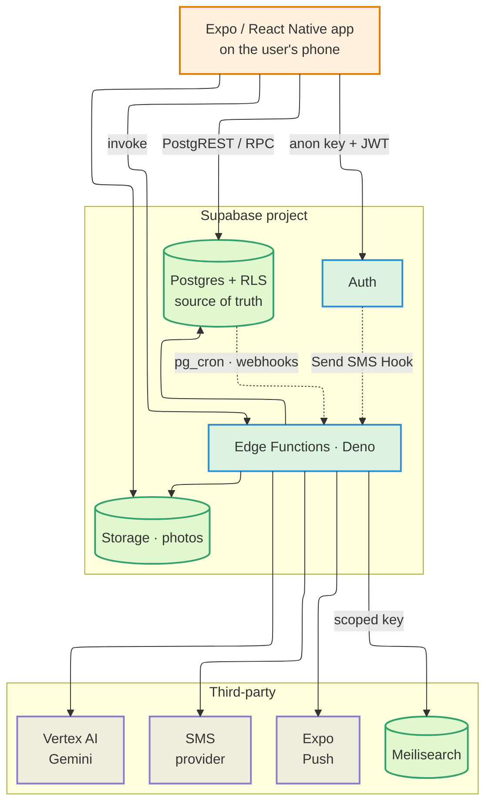
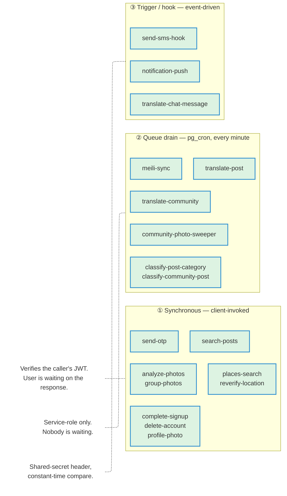
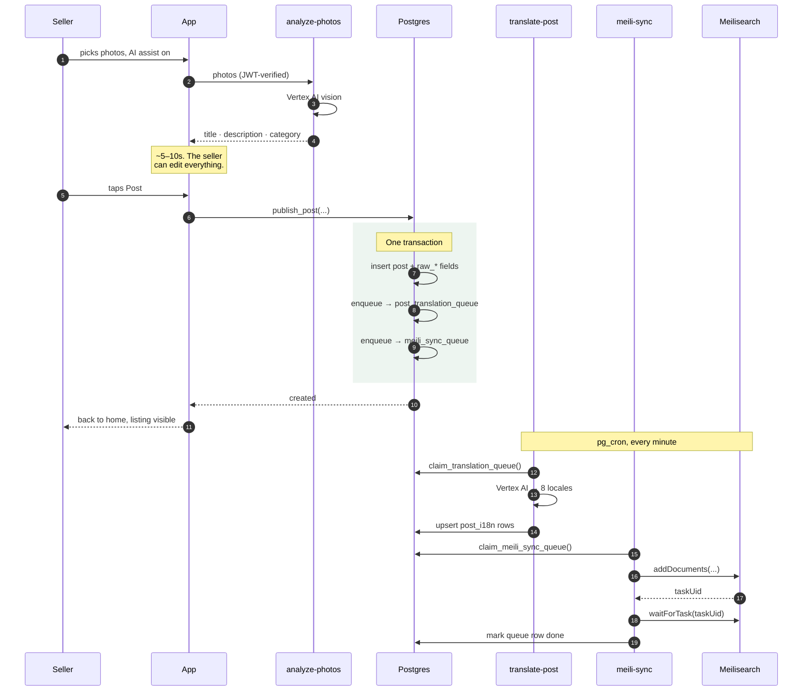
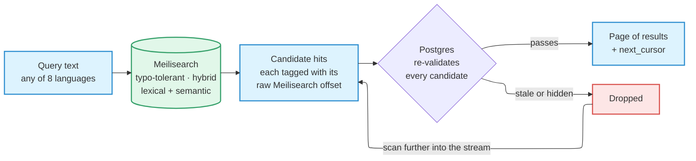
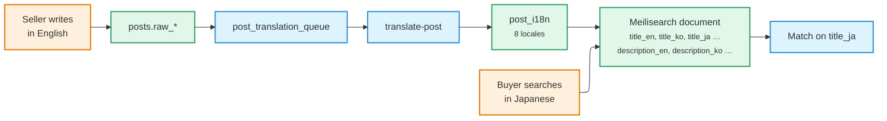

# Architecture

PopOut is a **single Expo application** with a Supabase backend living in the same
repository. Not a monorepo — one app, one backend, one deployment story.

The interesting part is not the box diagram. It is that the backend runs work in
**three different invocation models**, and that the search read path treats its own
search index as untrusted. Both are covered below.

## System context

Two rules are visible in that picture and worth stating outright:

- **The app never holds a privileged credential.** It carries the Supabase
  anonymous key and the signed-in user's JWT, and nothing else. No Meilisearch
  key, no model credential, no SMS credential.
- **The dotted arrows are not client-initiated.** Auth calls an edge function to
  deliver an SMS; Postgres calls edge functions on a schedule and on triggers.
  Those paths exist whether or not anyone has the app open.

## The three invocation models

Every edge function falls into exactly one of these, and which one it is
determines how it authenticates and what it may assume.

| | ① Synchronous | ② Queue drain | ③ Trigger / hook |
| --- | --- | --- | --- |
| Invoked by | The app | `pg_cron`, once a minute | A DB trigger, or Supabase Auth |
| Authenticates via | The caller's JWT | Service-role key | A shared secret in a header |
| Latency budget | A user is watching | None — eventual | Near-real-time, best effort |
| On failure | Return an error the UI can render | Mark the row failed and retry | Retry or drop, per function |

**Why the second model exists at all.** Translation into 8 languages and a search
re-index are both slow and both fallible. Doing either inline would mean a seller
watching a spinner while a model call runs, and a listing that fails to publish
because a downstream index was briefly unavailable. Instead the write commits
immediately and the slow work is queued — the **transactional outbox** pattern.
The listing is live either way.

## Publishing a listing

This is the clearest example of that split. The seller's request finishes in one
transaction; four background passes then catch up.

Three details in there are load-bearing, and each exists because of a specific
failure:

**Translation is symmetric.** Every locale goes through the model, *including* the
one the seller wrote in. The prompt instructs it to preserve text verbatim when
source and target match, so the seller's own language is a pass-through rather
than a special case. That keeps the publish path free of pre-seeding logic and
handles mixed-language input naturally.

**`meili-sync` waits for the Meilisearch task.** Accepting a task is not
committing it. Marking the queue row done on the `taskUid` alone would let a
later validation failure leak out of the outbox with the row already marked
finished — the document silently absent from the index, with nothing left to
retry it.

**Claims are leased, not locked.** The queue-claim functions stamp a claim time
and reclaim rows whose lease has expired, so a function that crashes mid-batch
does not strand its rows. Concurrent invocations do not stomp each other:
`SKIP LOCKED` for translation, and per-post advisory locks with a compare-and-set
for the search sync.

## The search read path

The single most important thing to understand about search:

:::info[Meilisearch ranks. Postgres decides.]

The index generates *candidates*. It is never authoritative about whether a
listing may be shown to this particular person.

:::

Every candidate is re-checked against Postgres before it can be returned:

| Check | Catches |
| --- | --- |
| Is the listing still live? | Sold or withdrawn since the last index sync |
| Is the seller banned or deleted? | An account actioned since the last sync |
| Is either party blocking the other? | Block lists are bidirectional and per-viewer, so they cannot be baked into a shared index |
| Is it inside the requested price range? | A price edited since the last sync |

**Why re-validate at all?** Because the index is synced through the same
once-a-minute outbox as everything else, so it can be **up to about a minute
stale**. A listing sold thirty seconds ago is still in the index. A seller banned
forty seconds ago still has listings in it. Serving the index directly would show
both.

**Why the cursor carries a raw offset.** Because validation removes an
unpredictable number of hits from each batch, page boundaries do not line up with
Meilisearch offsets. The cursor points at the raw offset of the first *unreturned
valid* hit, so nothing is skipped or duplicated as a reader pages through a
stream that is being filtered underneath them.

The function is **anon-and-authed**: a guest can search, and a signed-in caller
additionally gets block-list filtering applied.

### Why cross-language search works

Search matches across languages because the *documents* are multilingual, not
because the query is translated:

Every listing carries a title and description field **per locale** in one index
document. A Japanese query hits `title_ja` on a listing written in English,
because that field was populated at publish time.

Retrieval is **hybrid** — lexical and semantic blended. An exact query like
"iPhone 13" still wins on the lexical side, while a loose one like "kicks" rides
the semantic side to "Vans sneakers".

## Client architecture

State is split three ways, and the split is deliberate — putting server data in a
client store is the mistake this layout exists to prevent.

| Kind of state | Lives in | Examples |
| --- | --- | --- |
| **Server state** | TanStack Query | Feed pages, a chat thread, a listing |
| **Global client state** | Zustand | Session, locale, app-wide UI flags |
| **Secrets** | SecureStore | Auth tokens — never `AsyncStorage` |
| **Local UI state** | `useState` in the component | A sheet being open, a form field |

The import direction between layers is enforced mechanically, not by review — see
[Repo Structure](./repo-structure.md#dependency-flow).

## The stack

Every row below is a locked choice, and the rationale is the reason it stays
locked. Changing one is a decision, not a preference.

### Client

| Layer | Choice | Why |
| --- | --- | --- |
| Runtime | Hermes (React Native 0.83) | Default RN engine since 0.70; JSC left core in 0.74 |
| Framework | Expo SDK 55 | The only managed RN framework with first-party EAS Build/Submit, OTA updates, and native components |
| Routing | Expo Router 55 | The only RN router with file-based routes on top of a native stack |
| Language | TypeScript 5, `strict: true` | Catches nullability and implicit-`any` at compile time; non-strict TS silently reintroduces runtime errors RN cannot recover from |
| Styling | NativeWind 4 + Tailwind 3 | Compiles Tailwind classes to `StyleSheet` at build time — no runtime style parsing |
| Server state | TanStack Query 5 | `useInfiniteQuery` + `getNextPageParam` is the shortest path to paginated feeds backed by a virtualised list |
| Client state | Zustand 5 | Only for genuinely global client state. Context re-renders the whole tree; Redux is overkill at this surface area |
| Lists | FlashList 2 | Mandatory for every list. V2 removed `estimatedItemSize` — do not pass it |
| Images | `expo-image` 3 | Memory and disk caching, blurhash placeholders, and off-screen request cancellation. Stock `<Image>` has none of these and stutters on feeds |
| Forms | React Hook Form 7 + Zod 3 | Uncontrolled inputs keep re-renders scoped to the changed field — critical on RN, where a controlled input re-renders the whole form per keystroke. Zod schemas double as TS types and runtime validators |
| Dates | date-fns 4 | Tree-shakable per-function imports; immutable API avoids the mutation footguns in plugin-based alternatives |
| Keyboard | `react-native-keyboard-controller` | Replaces RN's `KeyboardAvoidingView`, which is broken on Android and laggy on iOS |
| Native UI | `@expo/ui` (SwiftUI + Jetpack Compose) | The only library exposing real SwiftUI and Compose components behind one TS API |
| Maps | `react-native-maps` | Google Maps on Android, Apple Maps on iOS by default |
| i18n | i18next + react-i18next | Plurals, number and date formatting, and fallback chains, with hand-written TypeScript locale files powering typed keys and build-time completeness checks |

### Backend and services

| Layer | Choice | Why |
| --- | --- | --- |
| Backend | `@supabase/supabase-js` 2 | One SDK covers auth, Postgres with RLS, edge functions, and storage — no separate vendors to wire |
| Database | Postgres with row-level security | RLS is the security boundary. Client-side checks are UX, not enforcement |
| Server logic | Deno edge functions | Anything needing a secret, or trust the client cannot be given |
| Search | Meilisearch | Sub-50ms typo-tolerant search. Alternatives price per record or lack geo-filter parity |
| AI | Vertex AI (Gemini) | Vision for listing analysis and photo grouping; text for translation and classification |
| Auth | Supabase Auth (phone + SMS OTP) | See [Authentication](./authentication.md) |
| Push | Expo Push | One API for both platforms, already in the Expo toolchain |
| Observability | Sentry (`@sentry/react-native` 7) | Native crash symbolication (iOS dSYM, Android ProGuard) plus JS error capture in one SDK |
| Analytics | PostHog | Funnel and product analytics; disabled cleanly when its key is absent |
| CI/CD | EAS Workflows | The only CI that signs and submits to the App Store and Play Store without managing Fastlane and certificates by hand |

## Cross-cutting decisions

**Search never touches the client.** The app holds no Meilisearch key. The read
path uses a search-scoped key held by `search-posts`; the write path uses an
admin-scoped key held by `meili-sync`. Least privilege — the read path never needs
write scope.

**AI runs server-side, always.** Photo analysis, photo grouping, category
classification, and translation are all edge functions. The client uploads and
waits; no model credential ever reaches a device.

**A machine never files a listing it was unsure about.** The background category
classifier records its best guess but only *applies* a category when its
confidence flags are all true. A genderless fashion item — plain sliders, a cap —
produces one candidate under each side of Fashion and is filed by nobody until a
person decides. That failure mode is silent and unrecoverable if it goes the
other way, which is why the bar sits where it does.

**Fail soft on the way in, fail loud on the way out.** `group-photos` always
returns a usable grouping — one photo per group if the model call fails — because
the seller must be able to reach the review screen and merge by hand. By
contrast, a queue drain that cannot finish marks its row failed with the error
recorded, and retries.

**Light mode only.** There is no dark-mode support in the app. Do not add
`isDark` branches or `useColorScheme` reads. See
[Conventions](./conventions.md#design-tokens).

## Distribution

- **iOS:** iPhone only (`ios.supportsTablet: false`).
- **Android:** tablets excluded via the Play Console device catalog.
- **No landscape** on either platform.

## Upgrade policy

- Stay within ±1 minor of the latest stable release.
- Re-verify versions whenever the stack is touched.
- **Expo SDK pins compatible React, React Native, and Hermes versions — never bump
  those independently.** The authoritative matrix is
  [docs.expo.dev/versions](https://docs.expo.dev/versions/).
- During a public-launch stabilisation window, hold one SDK behind latest. SDK
  bumps land after the window closes, never inside it.
