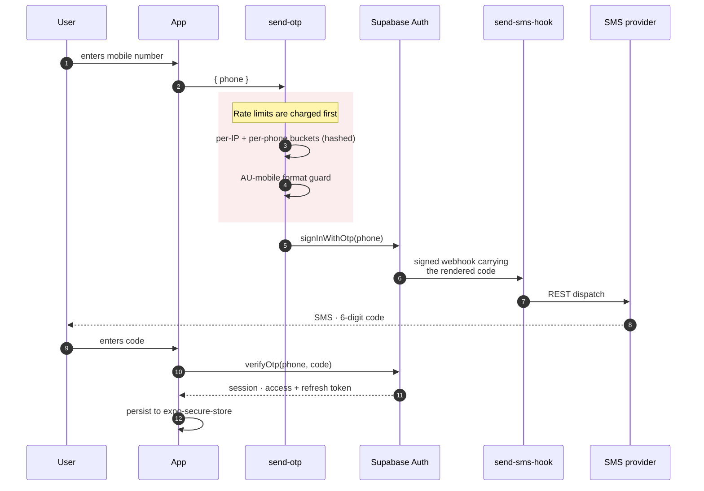

# Authentication

**Phone number + SMS one-time code.** Supabase Auth is the provider. There is no
email, no password, and no social login.

Sign-up and sign-in are the same flow: the user enters a phone number, receives a
code, and enters it. Supabase creates the user on first successful verification —
there is no separate registration step.

## The sign-in flow

Note the order inside the red block: **the buckets are charged before the body is
parsed and before the format check runs.** A probe loop sending malformed requests
still spends its own budget rather than getting free rejections.

Note also who generates the code. Supabase Auth does — `send-otp` never sees it,
and `send-sms-hook` only couriers it. There is exactly one code lifecycle a user
can trigger.

## Why phone-only

SMS is the channel sellers already share with buyers in a marketplace like this,
so it is not an extra hurdle. And a single auth channel cuts the abuse surface to
**one dimension to monitor** rather than several.

## SMS delivery

A third-party SMS provider handles delivery. Supabase Auth owns code generation,
expiry, and verification; the app's **Send SMS Hook** edge function is a pure
courier — it receives the already-rendered code from Supabase over a signed
[Standard Webhooks](https://www.standardwebhooks.com/) request, dispatches it via
the provider's REST API, and returns.

Two consequences worth knowing:

- **The hook URL embeds the Supabase project reference.** Each environment
  configures its own hook URL, pointing at the function deployed to that project.
  If a project is ever migrated, duplicated, or replaced, its hook URL must be
  re-pointed.
- **A single provider is intentional at current scale.** One set of secrets, one
  billing surface, and the hook is single-shot per request anyway. A backup
  provider is planned for roughly 1k DAU, or sooner if delivery rates drop —
  most likely as a secondary provider behind the same hook with conditional
  dispatch on primary failure.

## Code parameters

| Setting | Value |
| --- | --- |
| Code length | 6 digits |
| Expiry | 180 seconds |

These are configured in the Supabase dashboard **per project**, not in app code —
each environment holds the same values, set independently.

The 180-second window is wider than Supabase's 60-second minimum, to absorb
carrier SMS latency without timing legitimate signups out. It is well under the
5–10 minute industry default, which would create a larger replay window than this
app needs.

## Rate limiting and abuse defences

A `send-otp` edge function fronts `supabase.auth.signInWithOtp` and is the primary
rate-limit layer.

**Why it exists.** Supabase's built-in SMS rate limit is **project-global** — one
bucket shared across all callers. A single attacker can drain it and lock out
every user. The edge function adds **per-IP** and **per-phone** buckets so abuse is
confined to the attacker's own budget.

Both buckets are hashed, and both are evaluated **before** the request body is
parsed and before the format check runs — so probe loops still spend budget rather
than getting free rejections.

The per-phone budget is sized to cover legitimate retry patterns (signup plus
occasional re-login) while making bulk abuse against one number expensive. The
per-IP budget is sized to tolerate shared NAT — cafés, universities, large
workplaces — without locking out groups of legitimate users.

**Country whitelist.** Australian mobiles only; anything else is rejected with
`INVALID_PHONE_FORMAT`. This eliminates the SMS-pumping attack vector, which
targets premium-rate international numbers — which is why no CAPTCHA is wired
today.

Supabase's own per-project SMS rate limits sit beneath all of this as a hard cap
if the edge function is ever bypassed.

## Client session storage

Sessions are persisted with **`expo-secure-store`**, wired into the Supabase JS
client through its `auth.storage` option.

:::danger[Never use AsyncStorage for tokens]

`AsyncStorage` writes values in plaintext to disk. SecureStore uses the OS
keychain on iOS and Keystore on Android.

:::

**Token refresh.** `autoRefreshToken` is on. An `AppState` listener calls
`startAutoRefresh` on foreground and `stopAutoRefresh` on background, per
Supabase's React Native guidance — refresh stays on a real timer while the app is
foregrounded, and redundant refreshes are avoided while it is backgrounded.

**Sign-out scope.** The default is `'global'`, which revokes all refresh tokens
server-side. `'local'` is reserved for the post-account-deletion path, where the
server has already revoked the session.

## The security boundary

**Client-side auth is not a security boundary.** It decides what UI to show. It
decides nothing about what data a request may reach.

Enforcement is server-side, and there are two mechanisms:

1. **Row-level security.** Any table containing user-scoped data restricts access
   through RLS policies, written against `(SELECT auth.uid())`.
2. **Edge functions verify the JWT** before acting on a request.

A feature is not secure because the app hides a button. It is secure because the
row is unreachable.

## Secrets

SMS-provider credentials and the hook signing secret live in Supabase Secrets and
are read from edge functions at runtime. **None of them is ever in the app
bundle.** See
[Environments & Releases](./environments-and-releases.md#secrets-and-configuration)
for how they are set and rotated.
