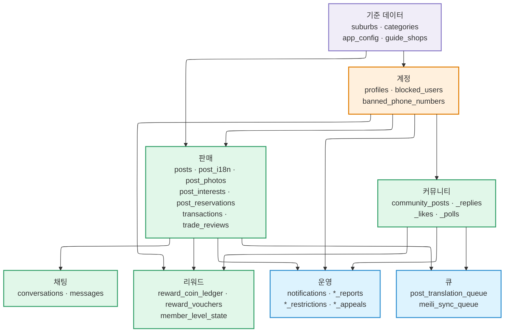
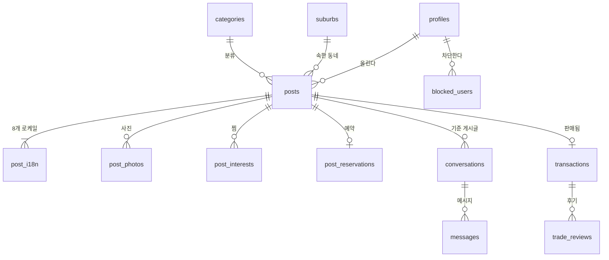

# 데이터베이스

Postgres에 PostGIS를 얹어 씁니다. 보안 경계는 RLS이며, 클라이언트는 테이블에 직접
쓰지 않고 대부분 RPC 함수를 통합니다.

:::warning[Confluence의 Database Schema 문서는 최신이 아닙니다]

내부 Confluence의 **Database Schema** 문서는 설계 단계 문서로, 실제 배포된 스키마와 **테이블 이름부터 다릅니다**.

| Confluence | 실제 |
| --- | --- |
| `items` | `posts` |
| `chat_rooms` | `conversations` |
| `likes` | `post_interests` |
| `reviews` | `trade_reviews` |
| `reports` | `post_reports`, `user_reports`, `community_content_reports` |
| `schedules`, `trade_history` | 없음 |

이 페이지는 `src/lib/supabase/types.ts`(마이그레이션에서 생성)를 기준으로 씁니다.
스키마를 확인할 때는 그 파일이 원본입니다.

:::

## 도메인 지도

테이블 70여 개가 일곱 도메인으로 나뉩니다. **`profiles`가 한가운데 있고, 나머지 거의 전부가
거기서 뻗어 나갑니다.**



| 색 | 뜻 |
| --- | --- |
| 보라 | 기준 데이터. 사용자보다 먼저 존재하고, 거의 변하지 않습니다 |
| 주황 | 계정. 나머지 대부분이 여기에 매달립니다 |
| 초록 | 기능 도메인. 사용자가 만들어 내는 것 |
| 파랑 | 시스템. 사용자가 직접 만들지 않지만 기능이 발생시키는 것 |

## 거래 흐름의 핵심 관계

판매 도메인의 뼈대입니다. 게시글 하나가 어떻게 대화와 거래로 이어지는지 보여 줍니다.



읽는 법 몇 가지:

- **`posts` → `post_i18n`은 1:다수이고 최소 1입니다.** 등록 시점에 8개 로케일이 전부
  채워지므로, 번역이 하나도 없는 게시글은 정상 상태가 아닙니다.
- **`conversations`는 `posts`에 매달립니다.** 채팅방이 판매자·구매자·게시글 셋에 묶인다는
  제품 규칙이 스키마에 그대로 있습니다.
- **`transactions`는 `posts`에 0 또는 1개**입니다. 팔리지 않은 게시글에는 없습니다.
- **후기는 `posts`가 아니라 `transactions`에 매답니다.** 게시글이 삭제돼도 후기가 남아야
  하기 때문입니다.

## 도메인별 테이블

### 계정과 프로필

| 테이블 | 역할 |
| --- | --- |
| `profiles` | `auth.users`와 1:1. 닉네임, 아바타, 인증된 동네, 언어 설정 |
| `blocked_users` | 차단 목록. 피드·검색·채팅에서 양방향으로 걸러냄 |
| `banned_phone_numbers` | 재가입을 막기 위한 번호 차단 |
| `internal_accounts` | 운영용 계정 표시 |
| `profile_photo_events`, `profile_photo_reviews`, `profile_photo_takedowns` | 프로필 사진 변경·검토·내림 이력 |

### 판매 게시글

| 테이블 | 역할 |
| --- | --- |
| `posts` | 게시글 원본. 상태, 가격, 위치, 카테고리 |
| `post_i18n` | 게시글의 로케일별 제목·설명. 등록 시점에 8개 언어로 채워짐 |
| `post_photos` | 게시글 사진과 순서 |
| `post_interests` | 관심 표시(찜) |
| `post_reservations` | 특정 구매자를 위한 예약 |
| `post_price_events` | 가격 변경 이력. 가격 인하 알림의 근거 |
| `post_ai_price` | AI가 제안한 가격 |
| `post_view_counts`, `post_view_events` | 조회수 집계와 개별 조회 기록 |
| `post_restrictions`, `restriction_appeals` | 게시글 제한과 이의 신청 |
| `post_reports` | 게시글 신고 |
| `transactions` | 확정된 거래 |
| `trade_reviews` | 거래 후 후기 |

### 채팅

| 테이블 | 역할 |
| --- | --- |
| `conversations` | 채팅방. 판매자·구매자·게시글 셋에 묶임 |
| `messages` | 메시지. 번역본을 함께 저장 |
| `auto_reply_events` | 자동 응답 이력 (현재 비활성) |

### 커뮤니티

| 테이블 | 역할 |
| --- | --- |
| `community_posts`, `community_post_i18n` | 커뮤니티 글과 번역 |
| `community_post_replies`, `community_reply_i18n` | 댓글과 번역 |
| `community_post_likes`, `community_reply_likes` | 좋아요 |
| `community_polls*` (`_options`, `_option_i18n`, `_votes`, `_vote_attempts`) | 투표 |
| `community_post_photo_labels` 계열 | 사진 라벨과 그 번역 |
| `community_post_view_counts` | 조회수 |
| `community_post_restrictions`, `community_restriction_appeals` | 제한과 이의 신청 |
| `community_content_reports` | 커뮤니티 콘텐츠 신고 |

### 리워드

| 테이블 | 역할 |
| --- | --- |
| `reward_coin_ledger` | 코인 원장. 잔액이 아니라 거래 내역이 원본 |
| `reward_listing_claims` | 게시글 보상 청구와 검토 상태 |
| `reward_invite_codes`, `reward_invitations` | 초대 코드와 성사된 초대 |
| `reward_phone_ledger` | 번호 단위의 1회 자격 관리 |
| `reward_voucher_products`, `reward_vouchers`, `reward_redemptions` | 상품권 목록·보유분·교환 |
| `member_level_points`, `member_level_state` | 프로필 레벨 포인트와 현재 레벨 |

### 기준 데이터와 운영

| 테이블 | 역할 |
| --- | --- |
| `suburbs` | 동네. 중심 좌표와 경계 폴리곤 |
| `categories` | 2단계 카테고리 |
| `app_config` | 런타임 설정 |
| `guide_shops` | 만남 장소로 제안되는 장소 |
| `notifications` | 인앱 알림 |
| `user_reports`, `user_feedback` | 사용자 신고와 피드백 |
| `search_events` | 검색 기록 (로그인 회원, 12개월 보관) |
| `suburb_weekly_snapshots` | 동네별 주간 지표 스냅샷 |

### 속도 제한

| 테이블 | 역할 |
| --- | --- |
| `otp_ip_limits`, `otp_phone_limits` | 인증번호 발송의 IP·번호별 버킷 |
| `phone_change_attempts`, `phone_change_attempt_limits` | 번호 변경 시도 |
| `places_search_limits` | 장소 검색 호출 제한 |

## 큐 테이블

느린 작업은 쓰기와 분리해 큐에 넣습니다. `pg_cron`이 1분마다 엣지 함수를 깨워
비웁니다. 자세한 이유는
[아키텍처](./architecture.md#세-가지-호출-모델)에 있습니다.

| 큐 | 처리하는 함수 |
| --- | --- |
| `post_translation_queue` | `translate-post` |
| `community_translation_queue` | `translate-community` |
| `meili_sync_queue` | `meili-sync` |
| `category_classify_state` | `classify-post-category` |

## 위치 처리

PostGIS를 씁니다. 좌표는 `geography(Point)`, 동네 경계는 `geography(Polygon)`입니다.

**동네 판정.** 사용자의 좌표가 어느 동네 경계 안에 들어가는지로 정합니다.

```sql
select id, name
from suburbs
where st_contains(boundary_geom, st_setsrid(st_makepoint(:lon, :lat), 4326));
```

**공간 인덱스가 없으면 느려집니다.** 경계와 게시글 위치 모두 GIST 인덱스가 필요합니다.
없으면 반경 필터가 전체 테이블을 훑습니다.

```sql
create index idx_posts_location on posts using gist (location);
```

## 규칙

**클라이언트는 RPC를 거칩니다.** 앱은 테이블에 직접 쓰지 않고
`publish_post`, `send_message_safe`, `reserve_post` 같은 함수를 호출합니다. 여러 테이블에
걸친 변경이 한 트랜잭션으로 묶여야 하기 때문입니다. 예를 들어 게시글 등록은 행 삽입과
번역·색인 큐 적재가 함께 일어나야 하고, 중간에 끊기면 안 됩니다.

**소프트 삭제를 씁니다.** 후기와 거래 이력이 남아야 하므로 행을 지우지 않고
`deleted_at`을 채웁니다.

**마이그레이션은 전진 전용입니다.** 되돌리는 마이그레이션이 없고, 적용된 것은 수정하지
않습니다. [환경과 릴리스](./environments-and-releases.md#마이그레이션)를 보세요.

**타입은 생성물입니다.** `src/lib/supabase/types.ts`는 손으로 고치지 말고
`supabase gen types`로 다시 만드세요. 마이그레이션과 같은 커밋에 들어갑니다.
