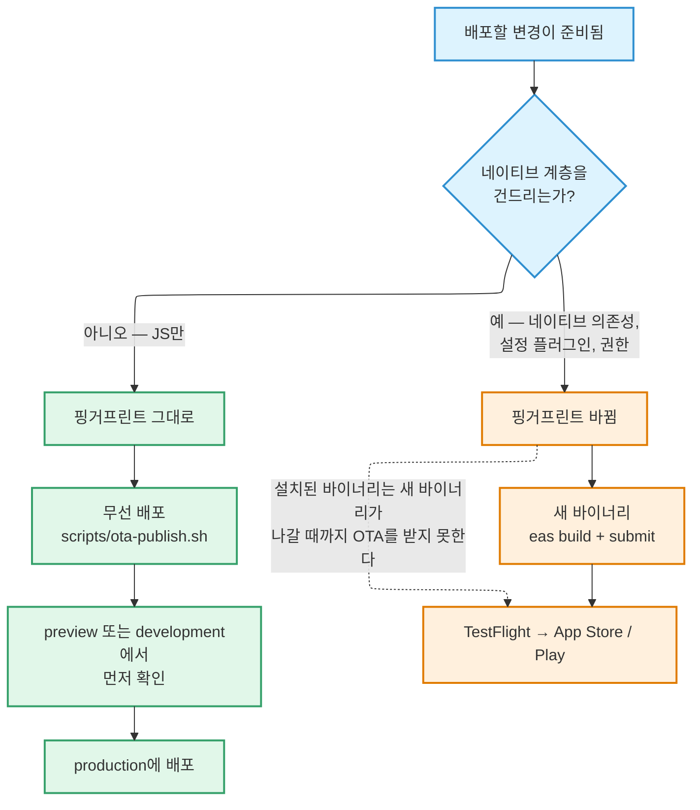

# 환경과 릴리스

Supabase 프로젝트는 **프로덕션**과 **스테이징** 두 개입니다. 스키마도 코드도 같고,
데이터와 URL만 다릅니다. 스테이징은 위험한 변경을 실제 사용자에게 보내기 전에 예행
연습하기 위해 존재합니다.

| 환경 | 목적 |
| --- | --- |
| `prod` | 실제 사용자가 접속하는 곳. 스키마와 기준 데이터의 원본 |
| `staging` | 위험한 변경을 프로덕션 전에 예행 연습하는 스키마 사본 |

스테이징은 프로덕션의 **스키마**를 그대로 따라갑니다. 모든 마이그레이션이 양쪽에
적용됩니다. 하지만 프로덕션 **데이터**는 따라가지 **않습니다**. 스키마만 복제했고 여기에
기준 데이터(동네, 카테고리, 설정)를 넣었을 뿐, 실제 사용자 데이터는 복사하지
않았습니다. 하이퍼로컬 데이터와 실명은 편의를 위해 복제할 성격의 것이 아니고, 사본이
하나 늘어날 때마다 지켜야 할 것이 하나 늘어납니다.

## 양쪽에 함께 적용하는 규칙

**모든 마이그레이션과 모든 엣지 함수 배포는 같은 커밋 안에서 두 프로젝트 모두에
적용됩니다.**

"스테이징은 나중에 맞추지"는 없습니다. 프로덕션에 뒤처진 스테이징은 스테이징이 아예
없는 것보다 나쁩니다. 믿게 되는데 그 믿음이 틀리기 때문입니다.

### 스테이징 먼저 적용해야 하는 변경

컬럼 추가, 인덱스 추가, RPC 추가처럼 위험이 낮은 변경은 순서가 상관없습니다. 다음은
스테이징에 적용하고 해당 흐름을 확인한 뒤 프로덕션에 적용합니다.

- 컬럼을 삭제·이름 변경·타입 변경하는 마이그레이션
- RLS 또는 스토리지 정책 변경
- 시크릿을 사용하는 엣지 함수의 변경
- 인증 설정 변경 — 제공자 설정, 훅 URL, OTP 파라미터
- SDK 업그레이드 (Expo SDK, `supabase-js`, 네이티브 패키지)
- 기존 행을 건드리는 기준 데이터 변경

**판단 기준:** 이 변경이 잘못된 버전으로 나갔을 때, 앞으로 나아가는 마이그레이션만으로는
되돌릴 수 없는 사용자 피해가 남는다면 스테이징을 거칩니다.

### 적용 결과 확인

**원장이 아니라 대상 객체를 직접 확인하세요.** 마이그레이션 원장은 전에도 틀린 적이
있습니다. 함수를 변경한 뒤 두 프로젝트가 일치하는지 확인하려면 양쪽에서 함수 소스의
해시를 비교하세요. 해시가 같다는 것이 증거입니다.

## 마이그레이션

전진 전용입니다. 되돌리는 마이그레이션은 없습니다. 이미 적용된 마이그레이션은 절대
수정하지 않고, 실수는 그 위에 새 마이그레이션을 얹어 바로잡습니다.

**스테이징에만 존재하는 마이그레이션은 없습니다.** 프로덕션에 넣을 가치가 없다면 아예
쓰지 마세요.

### 타입 생성

생성된 TypeScript 타입은 새 마이그레이션이 적용된 쪽에서 뽑습니다. 변경이 진행 중인
시점에는 보통 스테이징입니다. 두 프로젝트가 모두 따라잡으면 어느 쪽 기준으로도
유효합니다. 생성된 diff는 마이그레이션과 **같은 커밋**에 들어갑니다.

## 빌드 프로필

EAS 빌드 프로필은 공개 Supabase URL과 익명 키를 통해 백엔드를 선택합니다.

| 프로필 | 백엔드 | 배포 대상 | OTA 채널 |
| --- | --- | --- | --- |
| `development` | staging | 로컬 개발 클라이언트 | `development` |
| `preview` | staging | 내부 QA 빌드 | `preview` |
| `production` | prod | TestFlight + App Store | `production` |

프로필별 값은 EAS 환경에 설정합니다. `eas.json`이나 `.env`에 환경별 값을 하드코딩하지
**마세요**.

## 시크릿과 설정

사는 곳이 셋으로 나뉘며, 이것을 헷갈리는 것이 곧 사고로 이어집니다.

### 1. 클라이언트에 안전한 값 — 앱 번들에 포함

`process.env.EXPO_PUBLIC_*`으로 접근합니다. Expo가 이 접두사를 요구하며, 접두사가 없는
변수는 클라이언트에 번들되지 **않습니다**. 이것이 사고를 막는 장치입니다.

바이너리 안에 들어가도 안전한 값들입니다. Supabase URL, 익명 키(보안 경계는 키가 아니라
RLS입니다), 공개 지원 이메일 주소, PostHog 공개 키가 여기에 해당합니다.

:::danger

시크릿을 `EXPO_PUBLIC_*` 뒤에 두지 마세요. 이 접두사가 붙은 것은 모든 사용자 기기로
배포됩니다.

:::

### 2. 서버 전용 시크릿 — Supabase Secrets

앱 번들에 절대 닿으면 안 되는 값들입니다. 서비스 역할 키, Meilisearch 호스트와 두 개의
권한 제한 키, SMS 훅 서명 시크릿, SMS 제공사 자격 증명. 엣지 함수가 실행 시점에
읽습니다.

**프로젝트별로 각각 설정**합니다. 교체 순서는 상위 제공사에서 교체 → 스테이징에 설정 →
스테이징 확인 → 프로덕션에 설정입니다.

### 3. 빌드 타임 시크릿 — EAS 환경

컴파일 중 EAS Build가 사용하는 값으로, EAS에 환경별로 저장하며 `.env`나 `eas.json`에는
두지 않습니다.

- **Sentry 인증 토큰** — 빌드 후 소스맵을 업로드하는 데 씁니다. 이것이 없어도 빌드는
  성공하지만 스택 트레이스가 압축된 상태로 도착해 사실상 쓸모없어집니다.
- **Google Maps Android 키** — 빌드 시점에 읽혀 네이티브 빌드에 구워집니다.

빌드 타임 시크릿을 로컬 `.env`에 복사해 두는 것은 순수한 불일치이며, 실제로 혼란을
일으킨 적이 있습니다.

### 파일

| 파일 | 커밋하나? | 용도 |
| --- | --- | --- |
| `.env` | 아니요 — gitignore됨 | 로컬 개발 값 |
| `.env.example` | 예 | 값이 빈 키 목록. 새로 설정할 때의 기준 |

클라이언트에 안전한 변수를 새로 도입할 때마다 `.env.example`을 갱신하세요.

## 이 변경은 어느 경로로 나가는가

이것은 판단으로 정하는 문제가 아닙니다. 핑거프린트가 대신 정해 주며, 그 방식을 이
아래에서 설명합니다.

## 무선 업데이트 (OTA)

JS만 바뀐 수정은 무선으로 나가고, 실제 네이티브 변경은 새 바이너리가 필요합니다.

경계는 **핑거프린트** 런타임 버전 정책입니다. 런타임 버전은 네이티브 계층의 해시이므로,
업데이트는 네이티브 코드가 일치하는 바이너리에만 설치됩니다. `production` 바이너리는
`production` 채널을 구독하고 거기에 배포된 업데이트만 받습니다.

### 핑거프린트 안정성

핑거프린트는 **실제 네이티브 변경이 있을 때만** 움직여야 합니다. 그렇지 않으면 평범한
커밋 하나가 설치된 모든 바이너리를 고아로 만듭니다.

- **`.fingerprintignore`** (gitignore 형식 패턴)는 네이티브가 아닌 소스를 해시에서
  제외합니다. 애초에 포함되지 말았어야 할 파일을 한 줄 고친 것이 런타임을 바꿔서, 배포된
  업데이트가 어떤 기기에도 도달하지 못한 채 고아가 된 적이 있습니다.
- **`fingerprint.config.js`** 는 버전 필드를 제외합니다. 그래서 App Store Connect가
  버전 트레인을 닫을 때 강제하는 마케팅 버전 상향이 런타임을 흔들지 않습니다.

제외 목록은 **보수적으로** 유지하세요. 지나치게 많이 제외하는 쪽이 더 위험합니다. 실제
네이티브 변경이 호환되지 않는 바이너리에 무선으로 도달해 앱을 죽일 수 있습니다.

`.fingerprintignore`나 실제 네이티브 입력을 수정하면 핑거프린트가 바뀝니다. 그러면 기존
바이너리는 새 핑거프린트를 담은 바이너리가 나갈 때까지 OTA를 받지 못합니다.

### 배포하기

**`eas update`를 직접 쓰지 말고 저장소의 래퍼 스크립트로 배포하세요.**

이유는 구체적이고 심각합니다. `eas update`는 **로컬에서** 번들을 만들기 때문에, Metro가
여러분 노트북의 `.env`에 있는 `EXPO_PUBLIC_*` 값(보통 스테이징을 가리킴)을 프로덕션
번들이라고 믿는 것 안에 그대로 넣습니다. 그러면 실제 사용자가 조용히 스테이징
데이터베이스로 향하게 됩니다.

래퍼는 그 구멍을 막습니다.

1. 개발용 `.env`를 치워 두고 **대상** 환경의 값을 EAS에서 가져와, 번들이 그 환경의
   Supabase 프로젝트와 키를 담게 합니다.
2. 대상 채널로 배포하면서 같은 단계에서 소스맵을 Sentry에 업로드합니다.
3. 배포된 번들이 실제로 의도한 Supabase 프로젝트를 담고 있는지 **검사**하고, 배포된
   런타임이 해당 프로필의 완료된 빌드와 일치하는지 확인합니다.
4. 성공이든 오류든 Ctrl-C든, 종료 시 개발용 `.env`를 복원합니다.

`eas build`에는 이 과정이 필요 없습니다. 깨끗한 클라우드 체크아웃에서 돌면서 프로필별
EAS 환경 값을 읽기 때문입니다. 노트북의 `.env`를 읽는 것은 로컬에서 실행하는
`eas update`뿐입니다.

소스맵을 배포와 묶어 둔 것은 의도적입니다. 맨 `eas update`는 크래시가 Sentry에 압축된
채로 도착하는 번들을 내보내는데, 그러면 무선으로 빠르게 고친다는 목적 자체가 무너집니다.

**`production`에 배포하기 전에 반드시 `preview`나 `development` 빌드에서 수정 사항을
확인하세요.**
