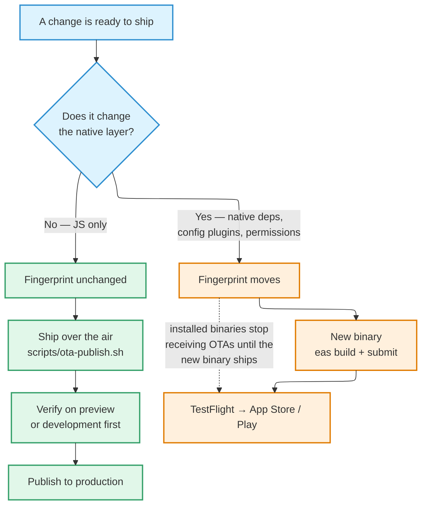

# Environments & Releases

Two Supabase projects: **prod** and **staging**. Same schema, same code, different
data and URLs. Staging exists to rehearse risky changes before they reach real
users.

| Environment | Purpose |
| --- | --- |
| `prod` | What real users hit. Source of truth for schema and seed reference data |
| `staging` | Schema mirror used to rehearse risky changes before they reach prod |

Staging mirrors prod's **schema** — every migration applies to both. It does
**not** mirror prod data. It was cloned schema-only, plus reference data
(suburbs, categories, config); no real user data was copied. Hyperlocal data and
real names are not the kind of thing to clone for convenience, and each copy is
one more thing to protect.

## The apply-to-both rule

**Every migration and every edge-function deploy runs against both projects, in
the same commit.**

No "I'll sync staging later." Staging that lags prod is worse than having no
staging at all, because you will trust it and be wrong.

### Staging-first changes

For low-risk changes — an additive column, a new index, a new RPC — order does not
matter. For the following, apply to staging, verify against the relevant flow,
then apply to prod:

- Migrations that drop, rename, or alter a column type
- Any change to RLS or storage policies
- Any change to an edge function that consumes a secret
- Auth configuration changes — provider settings, hook URLs, OTP parameters
- SDK upgrades (Expo SDK, `supabase-js`, native packages)
- Seed-data changes that touch existing rows

**Rule of thumb:** if a bad version of this change leaves user-visible damage that
a forward migration alone cannot fix, it goes through staging.

### Verifying an apply

**Probe the object, not the ledger.** Migration ledgers have been wrong before. To
confirm two projects match after a function change, compare a hash of the function
source across both — equal hashes are the proof.

## Migrations

Forward-only. No down migrations. An applied migration is never edited; a mistake
is corrected by a new migration on top.

**No staging-only migration ever exists** — if it is not worth landing in prod,
do not write it.

### Type generation

Generated TypeScript types come from whichever project has the new migration
applied — usually staging, at the moment a change is mid-flight. Once both
projects have caught up, the types are valid against either. The generated diff
lands in the **same commit** as the migration.

## Build profiles

EAS build profiles select the backend through the public Supabase URL and
anonymous key:

| Profile | Backend | Distribution | OTA channel |
| --- | --- | --- | --- |
| `development` | staging | Local dev client | `development` |
| `preview` | staging | Internal QA builds | `preview` |
| `production` | prod | TestFlight + App Store | `production` |

Per-profile values are set in EAS environments. **Never** hardcode a
per-environment value in `eas.json` or in `.env`.

## Secrets and configuration

Three separate homes, and mixing them up is the failure mode.

### 1. Client-safe values — bundled into the app

Accessed via `process.env.EXPO_PUBLIC_*`. Expo requires that prefix; variables
without it are **not** bundled into the client, which is what prevents accidental
leaks.

These are safe to ship inside the binary — the Supabase URL, the anonymous key
(RLS is the security boundary, not the key), the public support email address, and
the PostHog publishable key.

:::danger

Never put a secret behind `EXPO_PUBLIC_*`. Anything with that prefix is shipped to
every user's device.

:::

### 2. Server-only secrets — Supabase Secrets

Values that must never reach the app bundle: the service-role key, the
Meilisearch host and its two scoped keys, the SMS hook signing secret, and the SMS
provider credentials. Edge functions read them at runtime.

They are set **independently per project**. Rotation order is: rotate at the
upstream provider → set on staging → verify staging → set on prod.

### 3. Build-time secrets — EAS environment

Values consumed by EAS Build during compilation, stored per environment in EAS and
never in `.env` or `eas.json`:

- The **Sentry auth token**, used to upload source maps after a build. Without it
  the build still succeeds, but stack traces arrive minified and are effectively
  useless.
- The **Google Maps Android key**, read at build time and baked into the native
  build.

A copy of a build-time secret in a local `.env` is pure drift, and has caused real
confusion before.

### Files

| File | Committed? | Purpose |
| --- | --- | --- |
| `.env` | No — gitignored | Local dev values |
| `.env.example` | Yes | Key names with empty values; the reference for fresh setup |

Update `.env.example` whenever a new client-safe variable is introduced.

## Which lane does a change ship in?

The decision is not a judgement call — it is decided for you by the fingerprint,
and the rest of this section explains how.

## Over-the-air updates

JS-only fixes ship over the air; genuine native changes need a fresh binary.

The boundary is the **fingerprint** runtime-version policy: the runtime version is
a hash of the native layer, so an update only installs on a binary whose native
code matches. A `production` binary subscribes to the `production` channel and
pulls only updates published there.

### Fingerprint stability

The fingerprint must move **only** on real native changes, or routine commits
orphan every installed binary.

- **`.fingerprintignore`** (gitignore-style patterns) excludes non-native sources
  from the hash. A one-line change to a file that should never have counted has
  previously shifted the runtime and orphaned a published update so that it
  reached no device.
- **`fingerprint.config.js`** drops version fields, so a marketing-version bump —
  which App Store Connect forces whenever it closes a version train — does not
  shift the runtime either.

Keep the ignore list **conservative**. Over-excluding is the more dangerous
direction: it could let a real native change reach an incompatible binary over the
air and crash it.

Editing `.fingerprintignore`, or any real native input, changes the fingerprint —
so existing binaries stop receiving OTAs until a fresh binary embedding the new
fingerprint ships.

### Publishing

**Publish through the repo's wrapper script, never `eas update` directly.**

The reason is specific and severe. `eas update` bundles **locally**, so Metro
inlines the `EXPO_PUBLIC_*` values from your laptop's `.env` — normally pointed at
staging — into what you believe is a production bundle. That silently sends real
users to the staging database.

The wrapper closes that hole:

1. Stashes your dev `.env` files and pulls the **target** environment's values
   from EAS, so the bundle carries that environment's Supabase project and keys.
2. Publishes to the target channel and uploads the update's source maps to Sentry
   in the same step.
3. **Guards** that the published bundle actually carries the intended Supabase
   project, then verifies the published runtime matches a finished build for that
   profile.
4. Restores your dev `.env` on any exit — success, error, or Ctrl-C.

`eas build` does not need this. It runs in a clean cloud checkout and reads EAS
environment values per profile; only a local `eas update` reads your laptop's
`.env`.

Source maps are coupled to the publish deliberately: a bare `eas update` ships a
bundle whose crashes reach Sentry minified, defeating the entire point of a fast
over-the-air fix.

**Always verify a fix on a `preview` or `development` build before publishing to
`production`.**
