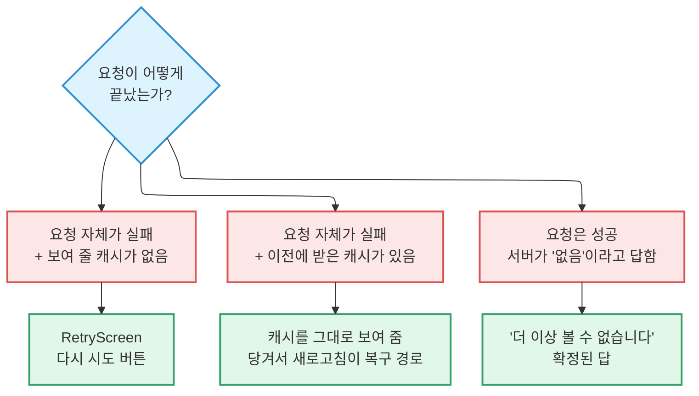

# 오류와 복구

무언가를 불러오지 못했을 때, 사용자에게 무엇을 보여 줄지는 **실패의 종류에 따라 다릅니다.**
이 셋을 섞으면 사용자에게 거짓말을 하게 됩니다.

## 세 가지 실패, 세 가지 처리



**핵심은 세 번째와 첫 번째를 구분하는 것입니다.** 게시글이 팔렸거나 내려갔거나 동네가
비활성화된 것은 **답이 없는 게 아니라 확정된 답**입니다. 여기에 "다시 시도"를 띄우면,
아무리 눌러도 같은 답이 돌아옵니다.

## RetryScreen

로드에 실패했고 복구 경로가 "같은 요청을 다시 보내기"일 때 쓰는 공용 화면입니다.

예전에는 화면마다 `HomeError`, `ChatRoomError`, `PostDetailError`, `ProfileError` …가
따로 있었고 각자 아이콘과 레이아웃과 문구를 들고 있었습니다. 지금은 하나로 통합돼 있습니다.

### 쓰는 경우

- 홈 피드 쿼리가 실패했고 돌아갈 캐시된 페이지가 없을 때
- 한 번도 열어 본 적 없는 대화방의 첫 조회가 실패했을 때
- 딥링크로 들어와서(피드 캐시를 거치지 않고) 게시글 상세 조회가 실패했을 때
- 프로필 탭의 내 게시글 목록이 콜드 상태에서 실패했을 때
- 콜드 스타트 세션 복원에서 인증 상태 재조회가 실패했고 렌더할 캐시가 없을 때

### 쓰지 않는 경우

:::warning[확정된 답에는 재시도를 붙이지 마세요]

조회는 **성공**했는데 서버가 "이용할 수 없음"이라고 답한 경우 — 판매 완료, 삭제된 게시글,
비활성화된 동네 — 는 전용 "더 이상 볼 수 없습니다" 화면으로 갑니다. 부재가 아니라
**확정된 답**이기 때문입니다.

:::

**이전 조회에서 받아 둔 캐시가 있으면 재시도 화면을 띄우지 않습니다.** 캐시된 내용을 그대로
두고, 배너도 띄우지 않습니다. 복구 경로는 당겨서 새로고침입니다.

### 계약

```ts
export interface RetryScreenProps {
  /** 화면마다 다른 제목. 공용 컴포넌트가 일반적인 제목을 고르지 않고,
   *  호출하는 쪽이 그 화면에 자연스럽게 읽히는 번역 문자열을 넘깁니다. */
  title: string;

  /** 선택. 복구 힌트가 자명하지 않을 때만 씁니다. */
  description?: string;

  /** 실패한 쿼리를 다시 실행합니다. */
  onRetry: () => void;

  /** 재시도가 진행 중이면 버튼을 비활성화하고 스피너를 보여 줍니다.
   *  호출하는 쪽에서 query.isFetching 을 연결합니다. */
  isRetrying: boolean;
}
```

**제목은 화면별, 나머지는 공용**입니다. 아이콘과 레이아웃은 컴포넌트가 정하며,
`icon` prop은 없습니다. 버튼 문구는 공용 i18n 키 하나(`common_retry`)를 쓰므로, 문구를
바꾸면 모든 화면이 함께 바뀝니다.

### 시각·접근성 계약

- 세로 가운데 정렬, 전체 화면. 아이콘 → 제목 → 버튼 세 요소가 쌓입니다.
- 색은 `useThemeColors()`에서 가져옵니다. **하드코딩된 hex 없음.**
- 재시도 버튼은 `role="button"`과 버튼 문구에 맞는 접근성 라벨을 갖습니다.
- 제목에는 `maxFontSizeMultiplier={1.4}`를 겁니다
  ([접근성](./accessibility.md#5-폰트-확대) 참고).
- RetryScreen은 배너나 팝업과 겹치지 않습니다. **그 화면의 오프라인 상태 표현 자체**입니다.

## 목록 안에서의 실패

전체 화면이 실패한 것과 **더 불러오기가 실패한 것은 다릅니다.**

페이지네이션이 실패하면 이미 있는 항목을 그대로 두고, 목록 하단에 작은 재시도 버튼만
보여 줍니다. **목록 전체를 오류 화면으로 바꾸지 마세요.** 읽고 있던 것을 빼앗는 셈입니다.

전체 UI 상태 규칙은 [컨벤션](./conventions.md#ui-상태)에 있습니다.

## 빈 상태와 오류를 혼동하지 마세요

:::danger[실패한 요청에 빈 상태를 렌더링하지 마세요]

"결과가 없습니다"는 **성공적으로 0건을 받았을 때만** 보여 줍니다. 요청이 실패했는데 빈
상태를 보여 주면, 사용자는 데이터가 없다고 믿게 됩니다. 원인도 해결책도 전혀 다른
문제인데도요.

:::
