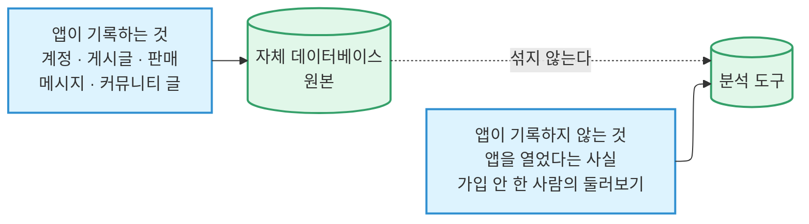

# 지표

PopOut이 무엇을 어떻게 세는지 정의합니다. **여기에 없으면 지표가 아닙니다.**

:::danger[이 문서는 정의를 담고, 값은 담지 않습니다]

숫자는 물어볼 때마다 새로 계산합니다. 여기에 적어 둔 숫자는 일주일이면 낡고, 그때부터는
조용히 사람을 오도합니다. 실제로 그렇게 해서 관리자 페이지와 어긋나는 회원 수, 아무도
재현하지 못하는 팬 수치가 나온 적이 있습니다.

:::

## 세는 규칙

**1. 회원은 `profiles` 행이 있는 사람입니다.** `auth.users` 행은 휴대폰 인증만 끝난
상태입니다. 그런 사람도 세션을 들고 앱을 열기 때문에, 프로필 존재를 확인하지 않는 집계는
전부 부풀려집니다.

**2. 내부 계정은 언제나 제외합니다.** 기준은 `internal_accounts` 테이블이며, 어딘가에
적어 둔 목록이 아닙니다. 창업자 계정, 스테이징 로그인, 모든 테스트 번호가 여기 들어
갑니다.

:::warning[코호트는 스스로 갱신되지 않습니다]

분석 도구에서 코호트를 쓸 때, 테이블에 계정을 추가하는 것은 1단계일 뿐입니다. 분석 쪽에
내부 플래그를 세우고, **코호트를 다시 저장해 재계산을 강제한 뒤**, 실제로 빠졌는지
확인해야 합니다. 코호트 소속은 캐시되며 저절로 새로고침되지 않습니다. 2026-08-22에는
플래그가 세워진 계정 30개가 27시간 동안 계속 집계됐습니다.

:::

**3. UTC가 아니라 멜버른 시간입니다.** 구간은 마지막 *완결된* 날에서 끝납니다. 그래서
오늘은 결코 DAU 수치가 될 수 없습니다. 진행 중인 날을 보려면 비교 대상 날짜도 같은
시각에서 잘라야 합니다.

**4. 게스트는 회원 옆에 적고, 절대 더하지 않습니다.** 게스트는 *한 대의 기기*이지 한 번의
방문이 아닙니다. 앱이 기기에 임의의 표식을 남기므로, 내일 돌아온 게스트는 같은 사람으로
인식되고 로그아웃해도 새로 시작하지 않습니다. **"회원 71명 + 게스트 43명"처럼 짝으로
적고, 하나의 합계로 만들지 마세요.**

게스트 수는 실제 사람 수보다 약간 높게 읽힙니다. 재설치, 앱 저장소 삭제, 계정 삭제가
각각 새 집계를 시작하고, 백업 복원은 두 대를 하나로 읽히게 하며, 공용 기기는 하나로
읽힙니다. 게다가 **콜드 스타트 직후에 만들어진 기록은 표식을 놓칠 수 있어** 기기가 아니라
방문으로 세어집니다. 드물고 작지만, 그래서 게스트 수치는 정확한 인원수가 아니라
**하한선**입니다.

## 두 개의 출처

**질문이 다르면 출처가 다르고, 두 출처를 하나의 숫자로 섞지 않습니다.**

자체 데이터베이스가 앱이 기록하는 모든 것의 원본입니다. 어떤 회원이 어떤 게시글을
언제 열었는지도 여기 있습니다. 다만 **누군가 그냥 앱을 열었다는 사실**과 **가입하지 않은
사람의 둘러보기**는 기록하지 않으므로, 그 부분만 분석 도구에서 옵니다.

가입하지 않은 사람에게서 발생하는 이벤트는 세 개뿐입니다 — 앱 열기, 앱 백그라운드,
피드 보기. 여기에 브라우징 측정 세 가지가 게스트·회원 여부를 달고 붙습니다. 나머지는
전부 회원 전용입니다.

### 절대 보내지 않는 것

앱은 휴대폰 번호, 이름, 정확한 위치, 메시지 내용, 게시글 가격이나 제목 등 **특정 사람이나
물건을 지목할 수 있는 것을 분석 도구에 붙이지 않습니다.**

검색어도 여기 들어가지 않습니다. 로그인한 회원이 입력한 단어는 자체 데이터베이스에
따로 보관하고, 게스트가 입력한 단어는 어디에도 남기지 않습니다.

### 회원 여부는 우리가 알려 줍니다

분석 도구는 누가 가입을 마쳤는지 스스로 알아낼 방법이 없습니다. 프로필이 생기는 순간
우리 쪽 가입 절차가 회원 플래그를 찍고, 내부 계정 플래그도 같은 방식으로 붙입니다.
**분석 도구는 우리가 보낸 것만 저장하며, 어느 쪽도 스스로 유도하지 않습니다.**

확인하는 방법이 세 가지 있는데, 셋의 신뢰도가 다릅니다.

| 방법 | 언제 쓰나 |
| --- | --- |
| 저장된 코호트 | 분석 도구 자체 대시보드를 훑어볼 때만. 재계산 전까지 당일 가입자가 빠져 있을 수 있습니다 |
| **쿼리 시점에 사람 단위로 플래그 확인** | **기본값.** 캐시가 없어 언제나 최신입니다 |
| 이벤트에 붙어 있는 플래그 복사본 | **절대 쓰지 마세요** |

마지막 것이 왜 위험한지가 중요합니다. 그 복사본은 **이벤트가 발생한 순간에 고정**됩니다.
그래서 같은 날 조금 뒤에 가입한 사람은 자기 이전 이벤트에서 비회원으로 읽힙니다. 물어보는
시점에는 분명히 회원인데도요.

### 기기 지문으로 되돌아가지 마세요

익명 기록을 기기 모델·OS·앱 버전·화면 크기로 묶는 것이 예전 방식이었고, 지금은 폐기됐으며
분명히 더 나쁩니다. 같은 기종을 쓰는 다른 사람을 하나로 합쳐 버리면서, 재실행한 사람은
여전히 중복으로 셌습니다. 그렇게 계산한 값은 표식 기반 집계와 **비교 자체가 불가능합니다.**

## 무엇을 보는가

주간, 완결된 주 기준입니다.

| 지표 | 정의 |
| --- | --- |
| **WAU** | 마지막 완결된 7일 안에 앱을 연 회원 |
| **1주차 잔존율** | 가입 코호트 중 가입 후 1~7일에 앱을 연 비율 |
| **팬** | 최근 28일 중 **8일 이상** 앱을 연 회원 |
| **신규 회원** | 그 주에 가입을 마친 수 |
| **기준을 넘은 동네** | 서로 다른 판매자 5명 이상이 올린 살아 있는 게시글 30개 이상인 동네 |
| **커뮤니티 응답률** | 24시간 안에 다른 사람의 댓글이 달린 글의 비율 |
| **문의율** | 구매자가 메시지를 1개 이상 보낸 게시글. 전체와 살아 있는 것을 따로 |

**1주차 잔존율이 주시 항목입니다.** 가장 이른 신호이고 가장 크게 움직입니다.

월간 또는 요청 시: MAU, 고착도(DAU ÷ MAU, 마켓플레이스 통념은 10~15%), 익명 도달.

**일간은 정기적으로 보지 않습니다.** 이 규모에서 DAU는 잡음만으로도 몇 명씩 흔들려서,
하루치는 이미 그 주가 말해 준 것보다 적게 말합니다. 릴리스나 캠페인을 조사할 때만 보고,
그 자체를 추세로 읽지 마세요.

## 이벤트 원장

**답을 얻고 싶은 질문, 그 답을 주는 것, 그리고 그게 지금 실제로 되는지**를 함께 적습니다.

> 답이 없는 질문은 **공백**입니다. 어떤 질문에도 답하지 않는 이벤트는 **과수집**입니다.

둘 다 나중에 발견되는 대신 여기서 바로 보이게 하는 것이 이 표의 목적입니다.

이벤트 목록 자체는 손으로 관리하지 않습니다. `src/lib/posthog.ts`의 타입 있는 레지스트리가
기계적 원본이며, 이벤트에 필드를 더하는 것은 런타임 변경이 아니라 그 파일을 고치는 일입니다.

### 상태 어휘

| 상태 | 뜻 |
| --- | --- |
| **Live** | 지금 수집 중 |
| **Blocked** | 만들어서 커밋됐지만 사용자에게 도달하지 않음. 그래서 아직 아무것도 답하지 못함 |
| **Broken** | 연결돼 있는데 기록을 **한 번도** 만들지 못함 |
| **Dormant** | 연결돼 있고 정확한데, 이를 발생시킬 상황이 프로덕션에서 일어난 적이 없음 |
| **Dead** | 선언만 되어 있고 보내는 쪽이 없음 |
| **Gap** | 이것을 수집하는 것이 아무것도 없음 |

**Broken과 Dormant를 구분하는 것이 핵심입니다.** 예를 들어 지도에서 장소를 여는 이벤트는
한 번도 발생한 적이 없지만, 이건 결함이 아닙니다. 그 이벤트는 커뮤니티 글이 3개를 넘는
가게에만 나타나는 "전체 보기" 줄에 붙어 있는데, 멜버른 전역의 지도 위 가게 16곳 중 가장
활발한 곳도 글이 하나뿐이라 그 줄이 그려진 적이 없습니다. 네 번째 글이 달리면 알아서
기록되기 시작합니다. **고칠 것이 없습니다.**

마찬가지로 계정 삭제 실패 이벤트도 한 번도 발생하지 않았습니다. 삭제가 실패한 적이 없기
때문입니다. 그것은 이벤트가 제대로 동작하고 있다는 뜻이지 공백이 아닙니다.

### 알려진 공백

**판매 소진율(sell-through)** 은 공백으로 남아 있습니다. 판매자에게 왜 게시글을 내리는지
묻기 전까지는 답할 수 없습니다. 삭제가 판매 완료 상태를 덮어쓰기 때문에, **답에 필요한
데이터가 만들어지는 바로 그 순간에 파괴됩니다.**

**찜과 좋아요**는 자체 기록에만 있고 분석 도구로 가지 않습니다. 우리가 가진 가장 강한
의도 신호인데, 지금은 이 원장 말고는 아무것도 읽지 않고 있습니다.

## 관련 문서

- 지표를 계산하는 테이블 → [데이터베이스](./database.md)
- 이벤트를 보내는 계층 → [아키텍처](./architecture.md#클라이언트-아키텍처)
