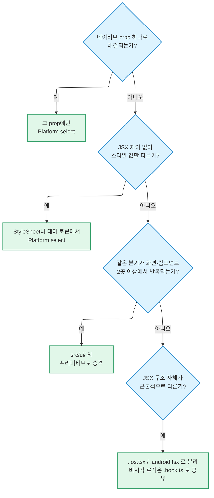

# 플랫폼 분기

OS에 따라 조건 분기하는 코드를 쓰기 전에 이 페이지를 먼저 읽으세요. **iOS와 Android
사이의 분기에 대한 판단은 전부 여기서 내립니다.**

범위는 OS 분기뿐입니다. 폼팩터는 세로 방향 휴대폰 하나뿐이고(태블릿은 배포 단계에서
제외), 웹은 아예 대상이 아닙니다. `.web.tsx` 파일을 만들지 마세요.

## 어디까지 가르는가 — Level 2

| 단계 | 범위 | 결정 |
| --- | --- | --- |
| **Level 1 — 토큰** | 색상, 타이포, 간격, 반경, elevation, 크롬 | 테마는 공유. 플랫폼 메커니즘 자체가 다른 곳(elevation, 시스템 폰트, 크롬 높이)만 값이 갈립니다 |
| **Level 2 — 컴포넌트** ✅ | iOS는 iOS 패턴, Android는 Material 패턴. **TS API는 같고 구현만 다름** | **채택** |
| **Level 3 — HIG 대 Material 전면** | 플랫폼별로 상호작용 모델 자체가 다름 | 기각 — "앱 두 개 분량의 일" |

**API 동일성은 타입으로 강제합니다.** 플랫폼별로 나뉜 파일은 공유 `.ts`(또는
`types.ts`)에 정의된 **하나의 props 타입**을 함께 씁니다. `.ios.tsx`와 `.android.tsx`가
같은 타입을 import하며, 어느 쪽도 자기만의 타입을 정의하지 않습니다. 이렇게 해야
Level 2의 "같은 TS API" 약속을 TypeScript가 자동으로 지켜 줍니다.

## 네이티브 우선 관문

분기 판단을 시작하기 **전에** 물어야 할 것이 하나 있습니다.

> 이걸 이미 해 주는 OS 기본 컴포넌트가 있는가?

있다면 그걸 쓰세요 — `NativeTabs`, Expo Router 헤더, `@expo/ui/*`, 시스템 시트·피커·
얼럿. 맞는 게 없을 때만 아래 결정 트리로 갑니다.

:::note[의도적으로 커스텀인 두 가지]

**헤더**와 **하단 탭바**는 이 관문에서 면제됩니다. 동네 선택 드롭다운이 달린 헤더는
Expo Router의 네이티브 헤더로 만들 수 없고, 알약 모양 탭바 디자인은 `NativeTabs`로
만들 수 없습니다. 둘 다 `src/shell/`에 있습니다.

:::

## 결정 트리

위에서부터 순서대로 보고, **처음 걸리는 곳에서 멈추세요.**

Metro가 빌드 시점에 `.ios.tsx`와 `.android.tsx`를 알아서 고릅니다. 공유 `index.ts`는
확장자 없이 re-export해서, 쓰는 쪽은 import 경로 하나만 보게 합니다.

:::warning[소비자 쪽에 `Platform.OS`가 있으면 안 됩니다]

분기는 **표면 프리미티브 안에서만** 일어납니다. 화면이나 기능 컴포넌트가
`Platform.OS`로 갈라지고 있다면, 그건 위 트리의 3번이나 4번을 건너뛴 것입니다.

:::

## 검증

**모든 변경은 iOS와 Android 양쪽에서 돌려 본 뒤에야 끝난 것입니다.** 한쪽에서
컴파일된다고 끝이 아닙니다. 크로스 플랫폼 계약을 지키는 것이 Level 2를 의미 있게
만드는 유일한 근거입니다.

## 관련 문서

- 수치 규칙(간격·타이포·터치 타깃) → [디자인 규칙](./design-rules.md)
- 색상 토큰과 화면 유형 → [컨벤션](./conventions.md#디자인-토큰)
- 배포 범위(태블릿·가로 모드 제외) → [아키텍처](./architecture.md#배포-범위)
