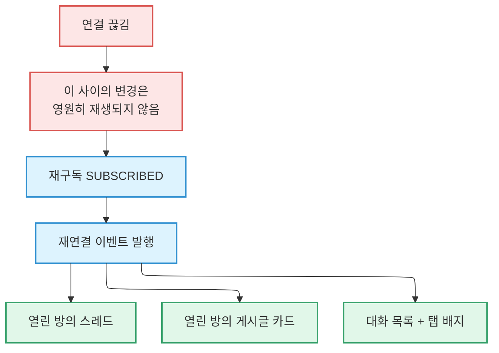

# 상태 조율

여기 있는 규칙들은 **어겨도 아무것도 실패하지 않습니다.** 타입 검사도 통과하고, 테스트도
통과하고, 화면도 잘 뜹니다. 그러다 어느 사용자의 기기에서 며칠 뒤에 틀린 값이 보입니다.

그래서 따로 적어 둡니다. 기능 문서의 **"상태 조율 불변식"** 절이 그 자리이고, 이 규칙은
코드를 바꾸는 커밋과 **같은 커밋에** 기록합니다. 나중에 적겠다는 것은 적지 않겠다는
뜻입니다.

## 1. 관찰자 없는 캐시 미러에는 수명을 직접 정하세요

`useQuery` 없이 `setQueryData`만으로 캐시에 값을 넣어 두는 패턴이 있습니다. 관찰자가
없으므로 TanStack Query는 그것을 **버려도 되는 값으로 봅니다.** 기본 GC 시간(약 5분)이
지나면 사라집니다.

```ts
// 관찰자 없는 미러는 기본 GC 대상 → 명시적으로 살려 둬야 합니다
queryClient.setQueryDefaults([...CHAT_PREFIX, 'messages'], { gcTime: Infinity });
```

이걸 빠뜨리면 **5분 넘게 닫아 둔 대화방을 오프라인에서 다시 열었을 때 스레드가
사라집니다.** 화면은 정상으로 보이고 그냥 비어 있습니다.

`Infinity`가 새지 않는 이유는 별도 장치가 있기 때문입니다. 사용자 계정이 바뀔 때마다
정리 로직이 해당 접두사의 쿼리를 통째로 제거합니다. **수명을 무한으로 두려면 지우는
쪽을 반드시 함께 만드세요.**

## 2. 실시간 재연결 시, 그 채널을 먹던 화면은 전부 다시 읽어야 합니다

Postgres 실시간 구독은 **연결이 끊긴 동안의 변경을 재생해 주지 않습니다.** 끊긴 사이에
일어난 일은 그냥 없는 일이 됩니다.



:::danger[규칙은 목록이 아니라 원칙입니다]

**실시간 변경을 먹고 사는 화면은 재연결 이벤트도 반드시 들어야 합니다.** 그 화면에
변경을 알려 줄 유일한 수단이 그 채널이었고, 끊긴 것이 바로 그 채널이기 때문입니다.

게시글 카드가 이 리스너 없이 만들어졌고, 화면을 벗어날 때까지 낡은 값을 보여 줬습니다.
새로운 종류의 결함이 아니라, **한 화면이 뒤늦게 합류한 것**뿐입니다.

:::

### "첫 연결은 건너뛰기" 최적화를 넣지 마세요

첫 구독에서는 마운트할 때 이미 조회했으니 다시 읽을 필요 없어 보입니다. **아닙니다.**

채널은 `SUBSCRIBED`라고 말하기 전까지 살아 있지 않고, 마운트 조회는 그것과 경주합니다.
조회 결과가 먼저 도착하면, **그 사이에 커밋된 변경은 어느 쪽에도 들어 있지 않습니다.**
화면이 남은 시간 내내 틀린 값을 보여 줍니다. 건너뛰려 했던 그 재조회가 바로 그 창을 닫던
장치였습니다.

이 최적화는 두 번 들어왔다가 두 번 지워졌습니다. **공짜 절약처럼 보이지만 그게 버그입니다.**
비용은 연결 성공당 재조회 한 번이고, 의도적으로 받아들인 값입니다.

## 3. 콜드 마운트에서는 무효화 전에 취소하세요

`invalidateQueries`만 부르면 **데이터가 없을 때는 아무 일도 일어나지 않습니다.**

TanStack Query(5.99.2 기준)는 `cancelRefetch`를 **`state.data`가 있을 때만** 존중합니다.
데이터가 없으면 이미 떠 있는 요청의 프로미스를 그대로 돌려줍니다. 그래서 방금 열린
화면에서의 무효화는 **변경 이전 시점을 찍은 그 마운트 조회에 흡수되고**, 그 조회가 낡은
값으로 완료되면서 화면이 계속 틀립니다.

```ts
// 새 요청이 실제로 나가게 만듭니다
await queryClient.cancelQueries({ queryKey: rowKey });
queryClient.invalidateQueries({ queryKey: rowKey });
```

이 재조회는 **비동기**입니다. 그래서 이걸 검증하는 테스트는 전부 마이크로태스크를
기다려야 합니다. **"일어나지 않아야 한다"를 확인하는 테스트도 마찬가지입니다** — 안
기다리면 아무것도 확인하지 않고 통과합니다.

## 4. 커밋 직전 가드로 쓰이는 쿼리는 절대 취소하지 마세요

3번 규칙에는 반드시 예외가 있어야 합니다.

`cancelQueries`의 기본값은 `revert: true`입니다. 취소된 조회는 **실패가 아니라 이전 값을
들고 성공으로 끝납니다.**

되돌릴 수 없는 쓰기 직전에 "다른 기기에서 이미 처리되지 않았는지" 확인하는 조회가 있다면,
그것을 취소하는 순간 **가드는 자기가 잡으려던 바로 그 낡은 값으로 통과합니다.**

:::warning[이 비대칭은 의도된 것입니다]

같은 화면에서 **표시용 행은 취소하고, 커밋 가드용 조회는 취소하지 않습니다.** 첫 수정
버전은 둘 다 취소해서 이 구멍을 갖고 있었습니다.

대가는 가드 쪽이 콜드 마운트 창을 그대로 안고 간다는 것입니다. **라벨이 잠깐 어긋나는
것과, 영구 기록이 틀리는 것 사이의 교환**이며 후자를 피하는 쪽을 골랐습니다.

:::

## 5. 실시간 채널 토픽은 구독 인스턴스마다 달라야 합니다

Supabase 실시간 클라이언트는 **같은 토픽으로 채널을 요청하면 기존 채널을 돌려줍니다.**
그리고 이미 구독된 채널에 리스너를 붙이면 **동기적으로 예외를 던집니다.**

채널 제거는 비동기입니다. 그래서 이전 것이 아직 정리되지 않은 상태에서 같은 토픽으로 두
번째 구독이 일어나면 앱이 오류 화면으로 떨어집니다. 실제로 두 경로에서 일어납니다.

- 화면 freeze → unfreeze 재연결 (React가 패시브 이펙트를 다시 실행)
- 같은 대상에 대한 화면이 두 개 열림 (알림을 눌러 이미 열린 화면으로 들어가는 경우)

토픽에 **모듈 수준 단조 증가 카운터**를 붙이세요.

```
chat-room-post:<conversationId>:<postId>:<seq>
```

:::danger[`useRef`로 만들지 마세요]

같은 마운트가 재연결될 때 ref는 값이 유지되므로 **여전히 충돌합니다.** 결정적
토픽으로 되돌리는 것도 안 됩니다.

:::

## 6. 상대 시간을 보여 주는 memo 행에는 자체 시계가 필요합니다

"3분 전" 같은 라벨이 얼어붙는 고전적인 조합입니다.

1. TanStack Query의 구조적 공유가 변하지 않은 항목을 **동일한 객체 참조**로 돌려줍니다.
2. 그래서 `memo`로 감싼 행은 다시 렌더링되지 않습니다.
3. 탭을 오가도 화면이 마운트된 채로 남아 있어 리마운트도 없습니다.

당겨서 새로고침해도, 포커스 재조회가 일어나도, 실시간 무효화가 와도 **라벨은 그대로**
입니다. 앱을 완전히 껐다 켜야 고쳐집니다.

해결책은 행이 **안쪽에서** 다시 렌더링되게 하는 것입니다. `memo`가 막을 수 없는 자리에서요.

| 세부 | 이유 |
| --- | --- |
| 틱은 **타임스탬프가 아니라 카운터** | 구독자가 렌더 시점에 시계를 직접 읽으므로, 저장된 낡은 시각이 찍힐 수 없습니다 |
| 인터벌은 **모듈 수준 + 참조 카운트** | 행이 N개여도 타이머는 하나, 마지막 구독자가 사라질 때 정리 |
| 포그라운드 복귀 시 **재발행** | OS가 백그라운드에서 JS 타이머를 멈추기 때문 |

**부모에서 `now`를 prop으로 내려보내 "고치지" 마세요.** 행이 스스로 가질 수 있는 것을
위해 리스트 전체의 의존성을 다시 만드는 셈입니다.

## 7. 낙관적 전환이 그것이 의존하는 데이터를 앞지르면 안 됩니다

무언가를 만들자마자 화면을 "생성됨" 모드로 바꾸면, **그 모드의 모든 분기가 아직 도착하지
않은 행을 읽습니다.**

실제로 이렇게 나타났습니다. 제목이 빈 문자열로 떨어지고, 카드가 `null`로 렌더돼 사라졌다가,
행이 도착하면서 둘 다 튀어 들어옵니다. 사용자에게는 "방이 만들어질 때 깜빡인다"로 보입니다.

해결은 **행이 손에 들어올 때까지 캐시된 값으로 그 화면들을 계속 먹이는 것**입니다.

```ts
// 행이 도착하면 자동으로 캐시 폴백이 꺼집니다
const fallbackPost = conversation ? null : cachedPost;
```

**추가되는 요소는 이 처리를 하지 않습니다.** 버튼이 전환 시점에 나타나는 것은 빈칸이
아니라 추가이고, 행이 올 때까지 숨겨 봐야 변화 시점만 옮길 뿐입니다.

## 8. `renderItem` 의존성에 들어가는 콜백은 안정적이어야 합니다

리스트에 인라인 화살표 함수를 넘기면, 렌더마다 새 참조가 생기고 `renderItem`의 정체성이
바뀌며 **자식의 `memo`가 무력화됩니다.** 탭 한 번에 보이는 타일 전부가 다시 렌더링됩니다.

`useCallback`으로 감싸세요. 리스트가 클수록 대가가 큽니다.

## 왜 이걸 적어 두는가

위의 어느 것도 **저절로 드러나지 않습니다.** 잘못 짜도 컴파일되고, 대개 개발 중에는
정상으로 보입니다. 재연결 규칙을 어긴 화면은 네트워크가 끊길 때까지 멀쩡하고, 시계
규칙을 어긴 행은 화면을 오래 열어 둘 때까지 멀쩡합니다.

그래서 규칙과 **그것을 어겼을 때 실제로 벌어진 일**을 함께 적습니다. 규칙만 적으면
누군가 합리적인 이유로 최적화를 넣고, 같은 버그가 다시 들어옵니다.

## 관련 문서

- 클라이언트 상태 분리 → [아키텍처](./architecture.md#클라이언트-아키텍처)
- UI 상태(로딩·빈 상태·오류) → [컨벤션](./conventions.md#ui-상태)
- 실패 화면 → [오류와 복구](./error-recovery.md)
