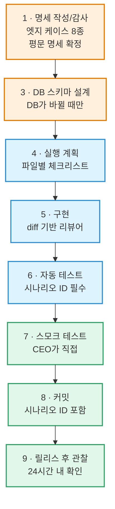
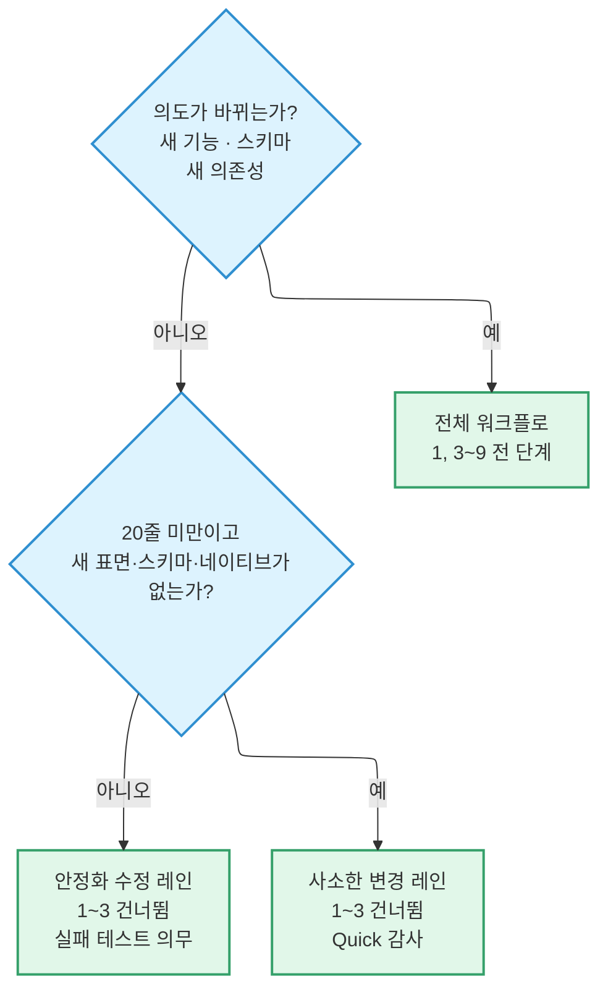

# 개발 워크플로

1인 개발 프로젝트입니다. **사람인 동료 리뷰어가 없습니다.** 이 워크플로 전체가 그
빈자리를 메우기 위해 존재합니다.

핵심 장치는 하나입니다. 모든 코드 변경은 **다른 모델**의 감사를 통과해야 커밋됩니다.

## 두 개의 역할

| 역할 | 하는 일 |
| --- | --- |
| **CEO** | 의도, 범위, 레인을 결정합니다. 평문 명세에 서명하고, 스모크 테스트를 직접 돌립니다 |
| **테크 리드** | 그 의도를 코드로 옮깁니다. 판단은 교차 모델 감사가, 기계적 규칙 강제는 서브에이전트가 맡습니다 |

**판단과 규칙 강제를 분리한 것이 요점입니다.** 서브에이전트 리뷰어는 기계적으로 확인할 수
있는 것만 봅니다. "더 나은 패턴이 있다" 같은 판단은 교차 모델 감사의 영역입니다.

## 아홉 단계

:::warning[순서를 바꾸지 마세요]

**현재 단계의 산출물이 존재하기 전에는 다음 단계로 넘어가지 않습니다.** 건너뛰려면 아래
두 레인 중 하나를 명시적으로 골라야 합니다.

:::

2단계는 없습니다. 원래 별도의 명세 확정 단계였는데 2026년 8월 점검에서 1단계로
접어 넣었습니다.

**7단계에서 CEO는 평문 명세만 봅니다.** 구현 문서는 펴지 않습니다. 그래야 스모크 테스트가
"만들어진 대로 동작하는가"가 아니라 **"의도한 대로 동작하는가"** 를 확인하게 됩니다.

## 교차 모델 감사

> **모든 코드 변경은 커밋 전에 다른 모델의 감사를 통과합니다.** 레인 예외 없고, 표면
> 예외 없습니다.

"작은 변경이니까", "UI만 바뀌니까" 건너뛰는 것은 잘못된 절약입니다. **모델 편향과 컨텍스트
편향이 정확히 이 장치가 막으려는 실패 모드**이기 때문입니다.

감사 강도는 변경 크기에 따릅니다. 표준 레인에서는 전체 검토, 사소한 변경 레인에서는
BLOCKING만 봅니다. 순수 문서·주석·포매팅 변경은 면제입니다.

### 심각도 세 단계

| 등급 | 무엇 | 어떻게 |
| --- | --- | --- |
| **BLOCKING** | 보안·데이터 손실, 명세 위반, 경쟁 조건, 명백한 논리 오류 | 반드시 응답. 수용해서 고치거나, 반박해서 CEO에게 에스컬레이션. **검토 거부 판정을 낼 수 있는 유일한 등급** |
| **STRONG** | 더 나은 패턴이 있음, 유지보수 우려, 표준 이탈이지만 결함은 아님 | 수용하거나, 이유를 밝혀 반박("이 프로젝트는 일관성을 위해 패턴 X를 유지한다"). 합의 안 되면 CEO |
| **ADVISORY** | 스타일, 이름, 소소한 개선 | 테크 리드가 결정. 받아들여도 넘겨도 됩니다 |

의견이 갈리면 CEO에게 **양쪽 논거와 함께** 올립니다. 그리고 결정에 필요한 세 가지를
같이 적습니다 — **사용자에게 보이는 결과가 있는가, 비용·유지보수에 영향이 있는가,
보안 위험 교환이 있는가.** CEO의 결정이 최종이고, 어느 쪽이 이겼든 **그 이유는 기능의
결정 이력에 남습니다.**

### 감사는 유한합니다

:::danger[무한 루프는 신호가 아니라 잡음을 만듭니다]

감사 라운드에 **하드 캡**이 걸려 있습니다. 1단계 2회, 3~6단계 3회입니다. 캡에 도달하면
게이트가 실행을 거부하고, 남은 지적은 항목별로 CEO에게 올라갑니다. 결정이 끝나면 확인
라운드 한 번이 허용됩니다.

근거가 있습니다. 2026년 8월 기간에 게이트 실행 **236회 중 200회가 "변경 요청"** 이었습니다.
무한 루프 상태였고, **후반 라운드는 결함이 아니라 문장을 지적하고 있었습니다.** 신호는
첫 라운드에 들어 있습니다.

:::

캡은 **반복을 제한하는 것이지 감사 자체를 제한하는 것이 아닙니다.** 모든 변경은 여전히
교차 모델 감사를 통과합니다.

## 세 개의 레인

변경 하나가 셋 중 하나를 고릅니다. 레인은 테크 리드가 추론하고 **CEO가 확인**합니다.
진행 중에 조용히 바뀌는 일은 없습니다.

**안정화 수정 레인에서는 실패하는 테스트가 의무입니다.** 고치기 *전에* 쓰고, 깨진 코드에서
실제로 실패하는 것을 확인한 뒤, 고쳐서 초록으로 바뀌는 것을 봅니다. 이 레인의 감사는
예전에 UI·기능 안정화 수정이 교차 검토 없이 나가던 구멍을 막습니다.

:::note[레인을 잘못 골랐다는 신호]

사소한 변경 레인의 Quick 감사에서 사소하지 않은 지적이 나오면, **레인 선택이 틀린
것입니다.** CEO에게 올리고 다시 분류합니다.

:::

## 두 파일 명세 모델

기능 하나에 문서가 최대 두 개입니다. **독자가 다르고, 그래서 언어가 다릅니다.**

| | `<name>.md` | `<name>-implementation.md` |
| --- | --- | --- |
| 영역 | **CEO** | **매니저** |
| 담는 것 | 정상 흐름, 엣지 케이스 동작, 시나리오 분류, 스모크 절차 | 라우팅 표, 컴포넌트 지도, 스토어 키, RLS 정책, 시나리오 → 테스트 대응표, [상태 조율 불변식](./state-coordination.md) |
| 읽는 사람 | CEO가 스모크 시점에 **처음부터 끝까지** | 테크 리드와 리뷰어 |
| 존재 여부 | 언제나 | **선택 — 없는 것이 기본** |

**CEO 명세가 정본입니다.** 구현 문서는 작업 노트입니다.

### CEO 명세에 기술 용어를 쓰지 마세요

훅 이름, 스토어 이름, 라우터 API, RPC·함수·테이블·컬럼 이름, 페이로드 모양, 파일 경로,
마이그레이션 타임스탬프, SDK 오류 타입, 라이브러리 이름, 테스트 파일 경로 — **전부
금지입니다.**

:::tip[판별법]

**엔지니어가 아닌 사람이 그 문장을 소리 내어 읽다가 걸린다면, 그 문장은 구현 문서로
가야 합니다.**

메커니즘이 아니라 결과로 번역하세요. "RPC가 `{state, reason, dormancy_required}`만
반환한다"가 아니라 **"관문을 통과하기 전에는 사용자에 관한 어떤 것도 기기에 도달하지
않는다"** 입니다.

:::

### 구현 문서는 없는 것이 기본입니다

세션보다 오래 살아남아야 할 내용이 있을 때만 만듭니다 — 상태 조율 불변식, 시나리오 →
테스트 대응표, 감사 델타 기록. 셋 다 없는 기능에는 구현 문서가 없고, 그것은 **누락이
아니라 정상**입니다.

감사 델타 기록은 **반드시 구현 문서**에 둡니다. 코드가 명세를 얼마나 지키고 있는지를
추적하는 내용이므로 정의상 매니저 영역입니다. CEO 명세는 의도와 동작을 적고, 구현 문서는
코드가 지금 그 의도를 어떻게 지키고 있는지를 적습니다.

## 명세와 현실을 붙여 두기

이 워크플로가 막으려는 실패는 **코드가 바뀌었는데 문서가 따라오지 않는 것**입니다.

| 무엇이 바뀌면 | 어디를 같은 커밋에서 고치나 |
| --- | --- |
| 사용자에게 보이는 동작 | `docs/features/<name>.md` |
| 상태 조율 불변식 | `<name>-implementation.md` |

**같은 커밋**이라는 것이 규칙의 전부입니다. 나중에 적겠다는 것은 적지 않겠다는 뜻입니다.

모든 테스트는 자기가 검증하는 시나리오를 주석으로 답니다(`// Verifies scenario X.Y`).
그 주석이 시나리오와 테스트를 잇는 정본이고, 구현 문서의 대응표는 사람이 찾아보기 쉬우라고
있는 사본입니다. 대응표가 실제와 맞는지는
[기계적으로 검사](./testing-and-ci.md#시나리오-맵)합니다.

## 관련 문서

- 커밋 형식 → [컨벤션](./conventions.md#커밋)
- 무엇이 머지를 막는가 → [테스트와 CI](./testing-and-ci.md)
- 릴리스가 사용자에게 닿는 경로 → [환경과 릴리스](./environments-and-releases.md#이-변경은-어느-경로로-나가는가)
