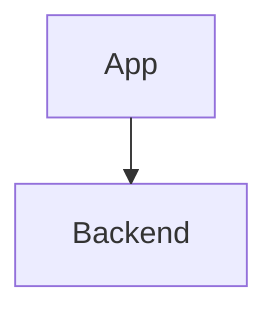

# Writing docs

## Adding a page

Create a Markdown file under `docs/`. The sidebar is autogenerated from the
folder tree, so the page appears in the nav with no config change:

```md title="docs/guides/checkout.md"
---
sidebar_position: 1
title: Checkout
---

# Checkout

Your content here.
```

That file is served at `/guides/checkout`.

:::note[Add pages in both languages]

This site ships English and Korean. When you add an English page, add its Korean
counterpart at the same path under
`i18n/ko/docusaurus-plugin-content-docs/current/`. Relative links resolve inside
a locale tree, so a missing counterpart fails the Korean build on any link
pointing at that page.

:::

## Frontmatter

| Field | Purpose |
| --- | --- |
| `title` | Page title, used in the sidebar and `<title>` tag |
| `sidebar_position` | Ordering within its folder, ascending |
| `slug` | Override the URL path (`slug: /` makes a page the site root) |
| `description` | Meta description for search engines and link previews |

## Grouping pages

A folder becomes a sidebar category. Add a `_category_.json` inside it to set
the label and position:

```json title="docs/guides/_category_.json"
{
  "label": "Guides",
  "position": 3
}
```

## Links

Link between pages by relative file path, including the extension:

```md
See [Installation](./installation.md).
```

Docusaurus resolves these to final URLs at build time and fails the build if the
target does not exist — so a passing build means no dead internal links.

## Images

Put images in `static/img/` and reference them from the site root:

```md

```

## Code blocks

Tag the language for highlighting, and optionally a title:

````md
```ts title="example.ts"
export const greet = (name: string) => `Hello, ${name}`;
```
````

## Admonitions

Docusaurus 3 takes the title in **square brackets**. The pre-v3 form
`:::note My title` does not parse and renders as literal text in the page, so
watch for that when copying older examples:

```md
:::warning[Read this first]

The warning body.

:::
```

`note`, `tip`, `info`, `warning`, and `danger` are available. Omit the brackets
entirely for an untitled admonition.

## Diagrams

Diagrams are authored as code — a ` ```mermaid ` fence renders as a diagram, so
it diffs in review like any other source.

````md

````

Two conventions:

- **Put `%%{init: {"layout": "elk"}}%%` on the first line.** The default layout
  engine makes no attempt to avoid crossing edges; ELK minimises crossings and
  routes edges orthogonally. Sequence diagrams have a fixed layout and ignore it.
- **Colour with `classDef`, carried by the stroke.** Use a strong `stroke` and a
  translucent fill, and do **not** set `color:` on a classDef — Mermaid's dark
  theme overrides label colour anyway, which would leave light text on a light
  chip. Copying the `classDef` lines from an existing diagram keeps the palette
  consistent.
