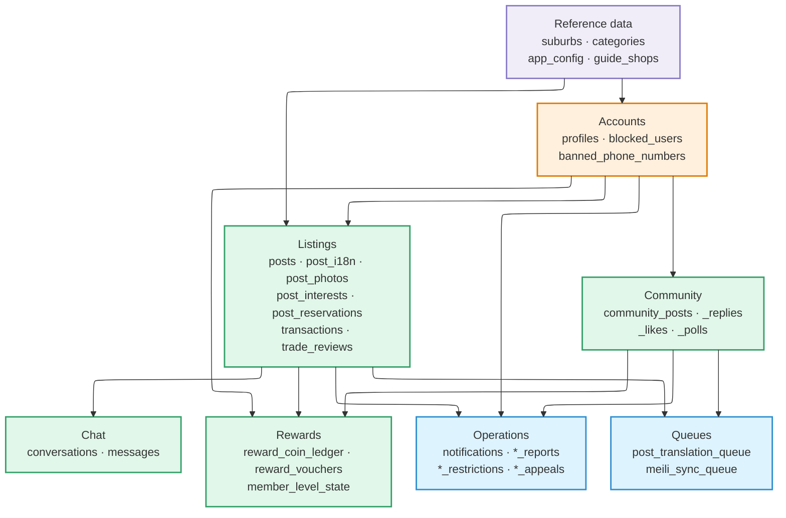
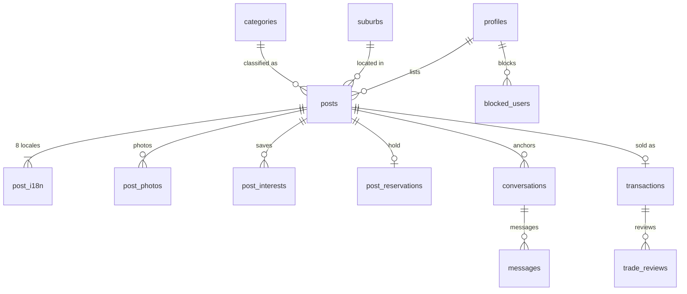

# Database

Postgres with PostGIS. RLS is the security boundary, and the client rarely writes
to a table directly — it goes through RPC functions.

:::warning[The Confluence Database Schema page is out of date]

The Confluence
[Database Schema](https://communitymelb.atlassian.net/wiki/spaces/SecondHand/pages/69861380)
is a design-stage document, and it differs from the deployed schema **starting
with the table names**.

| Confluence | Actual |
| --- | --- |
| `items` | `posts` |
| `chat_rooms` | `conversations` |
| `likes` | `post_interests` |
| `reviews` | `trade_reviews` |
| `reports` | `post_reports`, `user_reports`, `community_content_reports` |
| `schedules`, `trade_history` | Do not exist |

This page is written against `src/lib/supabase/types.ts`, generated from the
migrations. That file is the source of truth when checking the schema.

:::

## Domain map

Around seventy tables fall into seven domains. **`profiles` sits at the centre and
almost everything else hangs off it.**



| Colour | Meaning |
| --- | --- |
| Purple | Reference data. Exists before any user and rarely changes |
| Orange | Accounts. Most of the rest hangs off this |
| Green | Feature domains — what users create |
| Blue | System tables. Not created by users directly, but produced by what they do |

## The core trading relationships

The backbone of the listings domain — how one listing becomes a conversation and
then a trade.



A few things to read off it:

- **`posts` → `post_i18n` is one-to-many with a minimum of one.** All eight locales
  are filled at publish time, so a listing with no translations is not a valid
  state.
- **`conversations` hangs off `posts`.** The product rule that a room is anchored to
  seller + buyer + listing is in the schema itself.
- **`transactions` is zero-or-one per listing** — absent until it sells.
- **Reviews attach to `transactions`, not to `posts`**, so they survive the listing
  being deleted.

## Tables by domain

### Accounts and profiles

| Table | Role |
| --- | --- |
| `profiles` | 1:1 with `auth.users` — nickname, avatar, verified suburb, language |
| `blocked_users` | Block list, filtered bidirectionally out of feed, search, and chat |
| `banned_phone_numbers` | Number-level bans, to prevent re-registration |
| `internal_accounts` | Marks operational accounts |
| `profile_photo_events`, `profile_photo_reviews`, `profile_photo_takedowns` | Profile-photo change, review, and takedown history |

### Listings

| Table | Role |
| --- | --- |
| `posts` | The listing itself — status, price, location, category |
| `post_i18n` | Per-locale title and description, filled at publish time for all 8 languages |
| `post_photos` | Listing photos and their order |
| `post_interests` | Saved / interested markers |
| `post_reservations` | A hold placed for a specific buyer |
| `post_price_events` | Price change history, backing the price-drop hint |
| `post_ai_price` | AI-suggested price |
| `post_view_counts`, `post_view_events` | Aggregate counts and individual views |
| `post_restrictions`, `restriction_appeals` | Restricted listings and their appeals |
| `post_reports` | Reports against a listing |
| `transactions` | Confirmed trades |
| `trade_reviews` | Post-trade reviews |

### Chat

| Table | Role |
| --- | --- |
| `conversations` | The room, anchored to seller + buyer + listing |
| `messages` | Messages, stored with their translations |
| `auto_reply_events` | Auto-reply history (currently parked) |

### Community

| Table | Role |
| --- | --- |
| `community_posts`, `community_post_i18n` | Posts and their translations |
| `community_post_replies`, `community_reply_i18n` | Replies and their translations |
| `community_post_likes`, `community_reply_likes` | Likes |
| `community_polls*` (`_options`, `_option_i18n`, `_votes`, `_vote_attempts`) | Polls |
| `community_post_photo_labels` family | Photo labels and their translations |
| `community_post_view_counts` | View counts |
| `community_post_restrictions`, `community_restriction_appeals` | Restrictions and appeals |
| `community_content_reports` | Reports against community content |

### Rewards

| Table | Role |
| --- | --- |
| `reward_coin_ledger` | The coin ledger. Entries are the source of truth, not a balance column |
| `reward_listing_claims` | Listing reward claims and their review state |
| `reward_invite_codes`, `reward_invitations` | Invite codes and completed invitations |
| `reward_phone_ledger` | Tracks the once-per-phone-number eligibility |
| `reward_voucher_products`, `reward_vouchers`, `reward_redemptions` | Catalogue, held vouchers, redemptions |
| `member_level_points`, `member_level_state` | Level points and current level |

### Reference data and operations

| Table | Role |
| --- | --- |
| `suburbs` | Suburbs, with a centre point and a boundary polygon |
| `categories` | The two-level category tree |
| `app_config` | Runtime configuration |
| `guide_shops` | Places offered as meetup spots |
| `notifications` | In-app notifications |
| `user_reports`, `user_feedback` | User reports and feedback |
| `search_events` | Search history for signed-in members, retained 12 months |
| `suburb_weekly_snapshots` | Weekly per-suburb metric snapshots |

### Rate limiting

| Table | Role |
| --- | --- |
| `otp_ip_limits`, `otp_phone_limits` | Per-IP and per-phone buckets for OTP sends |
| `phone_change_attempts`, `phone_change_attempt_limits` | Phone-change attempts |
| `places_search_limits` | Caps on place-search calls |

## Queue tables

Slow work is decoupled from the write and queued. `pg_cron` wakes an edge
function every minute to drain each one. The reasoning is in
[Architecture](./architecture.md#the-three-invocation-models).

| Queue | Drained by |
| --- | --- |
| `post_translation_queue` | `translate-post` |
| `community_translation_queue` | `translate-community` |
| `meili_sync_queue` | `meili-sync` |
| `category_classify_state` | `classify-post-category` |

## Location handling

PostGIS. Coordinates are `geography(Point)`; suburb boundaries are
`geography(Polygon)`.

**Resolving a suburb** means asking which boundary contains the user's point.

```sql
select id, name
from suburbs
where st_contains(boundary_geom, st_setsrid(st_makepoint(:lon, :lat), 4326));
```

**Without spatial indexes this gets slow.** Both boundaries and listing locations
need GIST indexes; otherwise a radius filter scans the whole table.

```sql
create index idx_posts_location on posts using gist (location);
```

## Rules

**The client goes through RPC.** The app does not write to tables directly; it
calls functions like `publish_post`, `send_message_safe`, and `reserve_post`,
because changes that span several tables have to commit as one transaction.
Publishing a listing, for instance, must insert the row *and* enqueue the
translation and indexing work together, with no partial state in between.

**Deletes are soft.** Reviews and trade history have to survive, so rows are not
removed — `deleted_at` is set instead.

**Migrations are forward-only.** There are no down migrations, and an applied one
is never edited. See
[Environments & Releases](./environments-and-releases.md#migrations).

**Types are generated.** Do not hand-edit `src/lib/supabase/types.ts`; regenerate
it with `supabase gen types`. It lands in the same commit as the migration.
