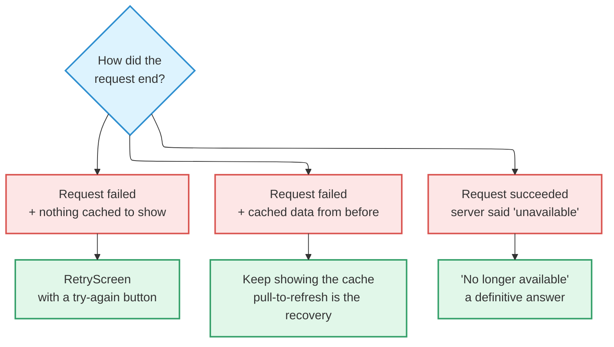

# Errors & Recovery

What the user sees when something fails to load **depends on how it failed**.
Conflating the three is how you end up lying to them.

## Three failures, three treatments



**The distinction that matters is the third case against the first.** A listing
that sold, was removed, or sits in a deactivated suburb is not an *absence* of an
answer — it is **a definitive answer**. Offering "try again" there means the user
can tap forever and get the same result.

## RetryScreen

The shared surface for "the load failed and the recovery path is to make the same
call again."

Each screen used to carry its own — `HomeError`, `ChatRoomError`,
`PostDetailError`, `ProfileError`, and more — each with its own icon, layout, and
copy. They are now one component.

### When to use it

- The home feed query failed and there is no cached page to fall back on.
- A never-opened conversation's first fetch failed.
- A post-detail RPC failed after arriving by deep link, bypassing the feed cache.
- The profile tab's own-listings query failed cold.
- Cold-start session restore failed with no cached data to render against.

### When not to

:::warning[Never put a retry on a definitive answer]

If the fetch **succeeded** and the server said "unavailable" — sold, removed,
suburb deactivated — that goes to the dedicated "no longer available" screen. It
is a definitive answer, not an absence of one.

:::

**If cached content from a prior fetch exists, do not show a retry screen.** Leave
the cached content in place and show no banner. Pull-to-refresh is the recovery
path.

### The contract

```ts
export interface RetryScreenProps {
  /** Surface-specific title. The shared component does not pick a generic
   *  one — the caller passes the localized string that reads naturally
   *  for that surface. */
  title: string;

  /** Optional. Only for surfaces with a non-obvious recovery hint. */
  description?: string;

  /** Re-fires the failed query. */
  onRetry: () => void;

  /** Disables the button and shows a spinner while the retry is in
   *  flight. Callers wire this to query.isFetching. */
  isRetrying: boolean;
}
```

**The title is per-surface; everything else is shared.** The icon and layout are
the component's decision — there is no `icon` prop. The button label comes from a
single shared i18n key (`common_retry`), so revising the copy flips every surface
together.

### Visual and accessibility contract

- Vertically centred, full-screen: icon → title → button.
- Colours come from `useThemeColors()`. **No hardcoded hex.**
- The retry button carries `role="button"` and an accessibility label matching its
  text.
- The title uses `maxFontSizeMultiplier={1.4}`, per
  [Accessibility](./accessibility.md#5-font-scaling).
- RetryScreen never overlaps a banner or popup — **it is** the offline state for
  that screen.

## Failures inside a list

A whole-screen failure and a **failed "load more" are not the same thing**.

When pagination fails, keep the existing items and show a small retry button in the
list footer. **Do not replace the list with an error screen** — that takes away
what the reader was already looking at.

The full set of UI-state rules is in [Conventions](./conventions.md#ui-states).

## Do not confuse empty with error

:::danger[Never render an empty state for a failed request]

"No results" is for a request that **successfully returned zero items**. Showing
it after a failure tells the user no data exists, which is a different problem
with a different fix.

:::
