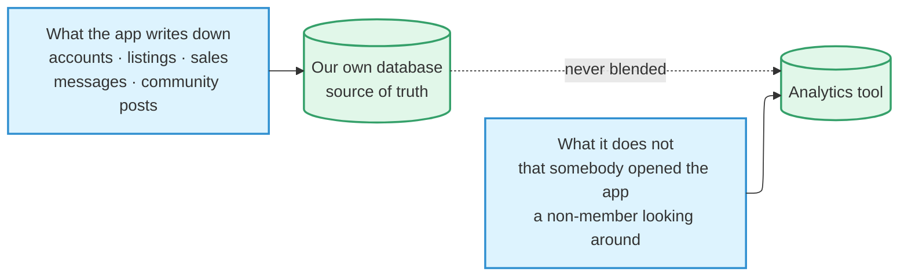

# Metrics

How PopOut counts things. **If a metric isn't here, it isn't a metric.**

:::danger[This page carries definitions, not values]

Numbers are computed fresh when asked. A number written down here is stale within
a week and quietly misleads from then on — which is how we ended up with a member
count that disagreed with the admin page and a fans figure nobody could
reproduce.

:::

## The counting rules

**1. A member is someone with a `profiles` row.** An `auth.users` row is only a
phone verification. Those people hold a session and still emit app opens, so any
headcount that does not check for a profile is inflated.

**2. Internal accounts are always excluded.** The `internal_accounts` table is the
source of truth, not a list kept somewhere — the founder's account, the staging
login, and every test number.

:::warning[Cohorts do not refresh on their own]

When using a cohort in the analytics tool, adding the account to the table is only
step one. Flag it internal on the analytics side, **re-save the cohort to force a
recalculation**, then verify the account actually dropped out. Cohort membership
is cached and never refreshes by itself. On 2026-08-22 it sat stale for 27 hours
while 30 flagged accounts kept counting.

:::

**3. Melbourne time, never UTC.** Windows end on the last *complete* day, so today
can never be a DAU figure. To read a day in progress, truncate the comparison days
at the same clock time.

**4. Guests are reported beside members, never added to them.** A guest is *one
phone*, not one visit: the app keeps a random tag on the device, so a guest
returning tomorrow is recognised as the same one, and signing out does not start a
new one. **Quote the pair — "71 members + 43 guests" — never a single total.**

The guest figure reads slightly above the number of real humans. Reinstalling,
clearing app storage, and deleting an account each start a new count; a restored
backup can make two handsets read as one; a shared phone reads as one guest. And
**records made in the first moments of a cold start can miss the tag**, counting as
a visit rather than a phone. Rare and small, but it makes the guest number a
**floor, not an exact headcount**.

## Two sources

**Different questions, different sources, never blended into one figure.**

Our own database is the source of truth for everything the app writes down,
including which listings a member has opened and when. What it has no record of is
somebody simply *opening* the app, or a visitor who has not joined looking around
— so those parts come from the analytics tool instead.

Only three events ever fire for somebody who has not joined: app opened, app
backgrounded, and feed viewed. Three browsing measurements join them, each
carrying whether a guest or a member did it. Everything else is members only.

### What is never sent

The app never attaches a phone number, name, exact location, message content,
listing price or title — **anything that points at a specific person or item.**

Search text does not go there either. A signed-in member's typed words are kept in
our own database instead; a guest's are not kept anywhere.

### We tell it who is a member

The analytics tool has no way to work out on its own who finished signing up. Our
signup process stamps a member flag on a person the moment their profile is
created, and the internal-accounts table drives an internal flag the same way.
**It only stores what we send; it never derives either flag itself.**

There are three ways to check that flag, and they are not equally trustworthy.

| Method | When to use it |
| --- | --- |
| The saved cohort | Only for a glance inside the analytics tool's own dashboards. A same-day signup can be missing from it until recalculation |
| **Checking the flag per person at query time** | **The default.** No caching, always current |
| The flag copied onto an event | **Never** |

Why the last one is dangerous matters. That copy is **frozen at the instant the
event fired**, so somebody who joined later the same day reads as a non-member on
their own earlier events — even though they are a member by the time anyone asks.

### Do not fall back to device fingerprints

Collapsing anonymous records to device model, OS, app version, and screen size was
the old method. It is obsolete and materially worse: it merged genuinely different
people on identical handsets while still overcounting anyone who relaunched.
Anything computed that way is **not comparable** with a tag-based count.

## What we watch

Weekly, on the complete week.

| Metric | Definition |
| --- | --- |
| **WAU** | Members who opened the app in the last 7 complete days |
| **Week-1 retention** | Share of a signup cohort opening the app on days 1–7 after joining |
| **Fans** | Members who opened on **8 or more** distinct days in the last 28 |
| **New members** | Completed signups that week |
| **Suburbs above the bar** | Suburbs with 30+ live listings from 5+ different sellers |
| **Community answered** | Posts getting a reply from someone else within 24h |
| **Contact rate** | Listings where the buyer sent 1+ message, all-time and live separately |

**Week-1 retention is the watch item** — the earliest signal available and the one
that moves most.

Monthly or on demand: MAU, stickiness (DAU ÷ MAU, against a 10–15% marketplace
norm), anonymous reach.

**Nothing daily, routinely.** At this size DAU swings by several people on noise
alone, so one day tells you less than the week already has. Read it when
investigating a release or a campaign, never as a trend on its own.

## The event ledger

Record **the question, what answers it, and whether that answer is actually
available today.**

> A question with nothing against it is a **gap**. An event answering no question
> is **overcollection**.

The point of the table is that both are visible here rather than discovered later.

The event list is not maintained by hand: the typed registry in
`src/lib/posthog.ts` is the mechanical source of truth, and adding a field to an
event is a deliberate edit there, not a runtime change.

### Status vocabulary

| Status | Meaning |
| --- | --- |
| **Live** | Collecting now |
| **Blocked** | Built and committed, but has not reached users — so it answers nothing yet |
| **Broken** | Wired up and has **never** produced a single record |
| **Dormant** | Wired up and correct, but the thing that triggers it has never happened in production |
| **Dead** | Declared, with nothing sending it |
| **Gap** | Nothing collects it at all |

**Telling Broken from Dormant is the point.** The event for opening a place from
the map has never fired, and that is correct rather than a fault: it sits on a
"see all" row that only appears once a shop has more than three community posts,
and across greater Melbourne the busiest of the 16 shops on the map has one. The
row has never been drawn. It will start reporting on its own when a shop gets a
fourth post — **nothing needs fixing.**

Likewise the account-deletion-failed event has never fired, because no deletion has
ever failed. That is the event working, not a gap.

### Known gaps

**Sell-through** stays a gap until sellers are asked why they are removing a
listing. Deleting overwrites the sold status, so **the data needed to answer it is
destroyed at the moment it would be created.**

**Hearts and likes** live only in our own records and never reach the analytics
tool. They are the strongest intent signal we hold, and nothing currently reads
them beside this ledger.

## Related

- The tables these are computed from → [Database](./database.md)
- The layer that emits the events → [Architecture](./architecture.md#client-architecture)
