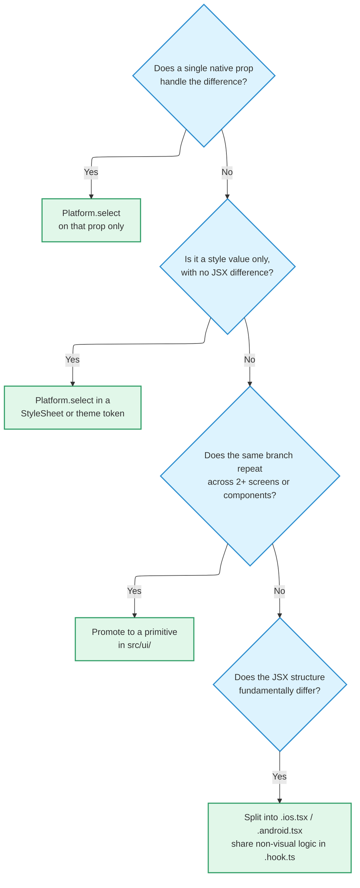

# Platform Divergence

Read this before writing any OS-conditional code. **Every decision about
branching between iOS and Android is made here.**

The scope is OS divergence only. There is one form factor — phones in portrait —
because tablets are excluded at distribution level, and the web is not a target
at all. Do not create `.web.tsx` files.

## How far to diverge — Level 2

| Level | Scope | Decision |
| --- | --- | --- |
| **Level 1 — tokens** | Colour, typography, spacing, radius, elevation, chrome | Shared theme. Values diverge only where the platform mechanism itself differs — elevation, system font, chrome heights |
| **Level 2 — components** ✅ | iOS uses iOS patterns, Android uses Material. **Same TS API, different implementation** | **Adopted** |
| **Level 3 — full HIG vs full Material** | Separate interaction models per platform | Rejected — "two apps worth of work" |

**API parity is enforced by the type system.** Platform-split files share a
**single props type** defined in the shared `.ts` (or `types.ts`). Both
`.ios.tsx` and `.android.tsx` import that same type, and neither defines its own.
That is what makes TypeScript hold Level 2's "same TS API" promise
automatically.

## The native-first gate

Before you start deciding how to branch, there is one question to ask.

> Is there an OS component that already does this?

If so, use it — `NativeTabs`, the Expo Router header, `@expo/ui/*`, the system
sheet, picker, or alert. Only when nothing fits do you move to the decision tree
below.

:::note[Two deliberate exceptions]

The **header** and the **bottom tab bar** are exempt from this gate. A header
with a location dropdown is not achievable with Expo Router's native header, and
the pill tab bar design is not achievable with `NativeTabs`. Both live in
`src/shell/`.

:::

## The decision tree

Work down in order and **stop at the first match.**

Metro resolves `.ios.tsx` and `.android.tsx` at build time. The shared `index.ts`
re-exports without the extension, so consumers see a single import path.

:::warning[No `Platform.OS` in consumer code]

Branching lives **inside surface primitives only**. If a screen or feature
component is branching on `Platform.OS`, step 3 or step 4 of the tree was
skipped.

:::

## Verification

**A change is not done until it has run on both iOS and Android.** Compiling on
one platform is not enough. Honouring the cross-platform contract is the only
thing that makes Level 2 mean anything.

## Related

- Numeric rules (spacing, type, touch targets) → [Design Rules](./design-rules.md)
- Colour tokens and screen types → [Conventions](./conventions.md#design-tokens)
- Distribution scope (no tablets, no landscape) → [Architecture](./architecture.md#distribution)
