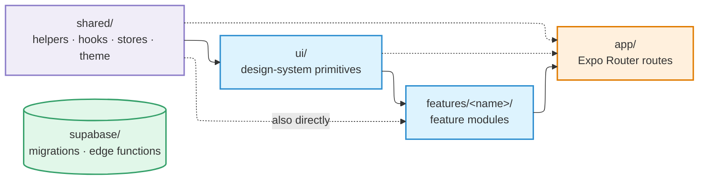

# Repo Structure

## Layout

```
app/                    Expo Router routes (thin re-exports only)
src/
  shell/                Custom header, custom tab bar
  ui/                   Design-system primitives (iOS/Android split lives here)
  shared/               Cross-feature helpers, hooks, stores, queries, theme
  features/<name>/      Feature modules (screens/components/hooks/queries)
  lib/                  Third-party wrappers (Supabase, Sentry, PostHog)
  i18n/                 Translation files
  types/                Ambient type declarations for untyped packages
supabase/
  migrations/           Forward-only SQL migrations
  functions/            Deno edge functions
  corrections/          One-time data corrections, run per environment (never replayed)
docs/                   Project rules and decisions
scripts/                Local scripts
```

`app/` mirrors the navigation structure of the app. Route files are **thin
re-exports** — a route file imports a screen from a feature module and renders it,
and holds no logic of its own.

## Dependency flow

Imports may only travel in the direction of the arrows. Nothing goes backwards.



`supabase/` sitting off to the side is deliberate: **nothing connects it to the
mobile code at all.**

`supabase/` is independent of all mobile code.

| Layer | May import from |
| --- | --- |
| `shared/` | Nothing else in `src/` |
| `ui/` | `shared/` only |
| `features/` | `shared/`, `ui/`, and other features per the tier rules below |
| `app/` | Anywhere in `src/` |

**No cycles.** Dependency cycles between features are forbidden, and the rule is
enforced mechanically by `madge --circular src/` at pre-commit — not by review.

## Feature tiers

Features are not all equal. Two tiers:

**Platform features** — foundational capabilities other features need in order to
function: `auth` and `notifications`. Any feature may import them.

**Leaf features** — everything else. A leaf feature may **not** import from
another leaf feature, outside of its own `screens/` directory.

If a leaf feature's helper turns out to be needed by another leaf feature, that is
the signal to **promote it to `shared/`** — not to reach across.

## The public API rule

Every feature exports its cross-feature surface through
`src/features/<name>/index.ts` — hooks, contexts, sheets, types, and query-key
constants.

Cross-feature imports go through that index:

```ts
// Correct
import { useAuthState } from '@/features/auth';

// Wrong — reaches past the public API
import { useAuthState } from '@/features/auth/queries/useAuthState';
```

### Two deliberate exemptions

**1. Screens are not re-exported.** Route files in `app/` import them by direct
path (`@/features/<name>/screens/<Screen>`). Keeping screens out of the index
keeps it light and stops native modules from being pulled into Jest evaluation
chains.

**2. Files inside `src/features/<X>/screens/` may import another feature's
internal paths.** Screens are the composition layer; letting them pull a richer
surface from another feature avoids forcing that feature to expose every internal
through its cross-feature index.

## Where a thing belongs

| You are writing | It goes in |
| --- | --- |
| A button, card, sheet, or other reusable visual primitive | `src/ui/` |
| The app header or tab bar | `src/shell/` |
| A helper, hook, or store used by more than one feature | `src/shared/` |
| Anything belonging to exactly one feature | `src/features/<name>/` |
| A wrapper around a third-party SDK | `src/lib/` |
| A route | `app/` — as a thin re-export |

## Backend layout

`supabase/migrations/` is **forward-only**. There are no down migrations, and an
applied migration is never edited — a mistake is corrected by a new migration on
top.

`supabase/corrections/` holds one-time data corrections that are run once per
environment and never replayed. They are kept separate from migrations precisely
so that nothing replays them.

`supabase/functions/` holds the Deno edge functions, one directory each, with
shared code under `_shared/`. Broadly they fall into four groups:

| Group | Examples |
| --- | --- |
| Auth and account | `send-otp`, `send-sms-hook`, `complete-signup`, `delete-account` |
| AI | `analyze-photos`, `group-photos`, `classify-post-category`, `classify-community-post` |
| Translation | `translate-post`, `translate-chat-message`, `translate-community` |
| Search, location, moderation | `search-posts`, `meili-sync`, `places-search`, `reverify-location`, `report-community-content`, `community-photo-sweeper` |

Anything holding a secret, or making a trust decision the client cannot be given,
belongs here rather than in the app.
