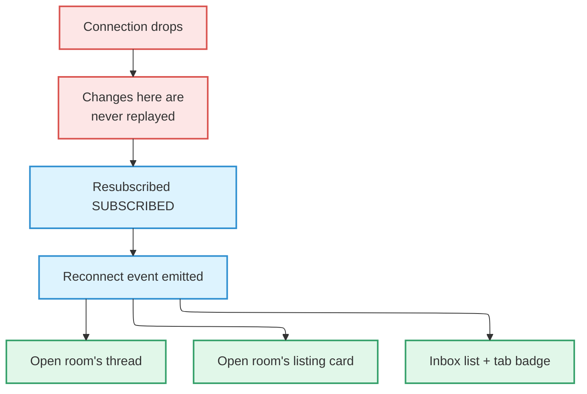

# State Coordination

Breaking any rule on this page **fails nothing.** Types pass, tests pass, the
screen renders. Then days later, on somebody's device, a value is wrong.

That is why they are written down. Each feature's implementation doc carries a
**"State Coordination Invariants"** section, and the rule is recorded in the
**same commit** as the code change. Writing it up later means not writing it up.

## 1. An observer-less cache mirror needs an explicit lifetime

There is a pattern where a value is pushed into the cache with `setQueryData` and
no `useQuery` observing it. With no observer, TanStack Query treats it as
**disposable** — the default garbage-collection window (about five minutes) takes
it.

```ts
// An observer-less mirror is a GC target — keep it alive deliberately
queryClient.setQueryDefaults([...CHAT_PREFIX, 'messages'], { gcTime: Infinity });
```

Miss this and **reopening a conversation closed for more than five minutes, while
offline, loses the thread.** The screen looks fine; it is simply empty.

`Infinity` does not leak because something else clears it: on every user-id
transition, cleanup removes every query under that prefix. **If you set an
unbounded lifetime, build the thing that clears it in the same change.**

## 2. On realtime resubscribe, every surface fed by that channel re-reads

A Postgres realtime subscription **does not replay changes that happened while it
was disconnected.** Whatever occurred in the gap simply never happened, as far as
the client is concerned.



:::danger[The rule is the principle, not the list]

**Any surface fed by realtime changes must also listen for the reconnect.** The
channel was the only thing that would have told that surface, and the channel is
exactly what went missing.

The listing card was written without this listener and showed a stale value until
the screen was left. That is not a new class of defect — it is **one surface
arriving late** to a known one.

:::

### Do not add a "skip the first join" optimisation

On the first subscribe it looks like the re-read is redundant, since the mount
already fetched. **It is not.**

The channel is not live until it says `SUBSCRIBED`, and the mount fetch races it.
When the fetch's snapshot lands first, **a change committed in between is in
neither**, and the surface stays wrong for the rest of its life. The re-read you
wanted to skip is precisely what closed that window.

This optimisation was added twice and deleted twice. **It looks like a free
saving and it is the bug.** The cost is one narrow re-read per successful join,
accepted deliberately.

## 3. On a cold mount, cancel before you invalidate

Calling `invalidateQueries` on its own **does nothing when there is no data yet.**

TanStack Query (as of 5.99.2) honours `cancelRefetch` **only when `state.data` is
defined**. With no data it returns the in-flight promise instead. So an
invalidation on a just-opened screen is **absorbed by the very mount fetch whose
snapshot predates the change**; that fetch resolves with the old value, and the
surface stays wrong.

```ts
// Makes the follow-up a genuinely new request
await queryClient.cancelQueries({ queryKey: rowKey });
queryClient.invalidateQueries({ queryKey: rowKey });
```

This re-read is **asynchronous**, which is why every test asserting on it must
flush a microtask — **including the negative test**, which otherwise passes
vacuously without asserting anything.

## 4. Never cancel a query used as a commit-time guard

Rule 3 has to carry an exception.

`cancelQueries` defaults to `revert: true`. A cancelled read does not fail — it
**resolves as a success carrying the previous value.**

If a read sits immediately before an irreversible write, checking whether another
device already handled it, cancelling that read makes **the guard pass on exactly
the staleness it exists to catch.**

:::warning[The asymmetry is deliberate]

On the same screen, **cancel the display row and never cancel the commit guard.**
The first version of this fix cancelled both and carried that hole.

The price is that the guard keeps the cold-mount window the display row no longer
has. That is **a label being briefly wrong against a permanent record being
wrong** — and the second is the one worth avoiding.

:::

## 5. A realtime channel topic must be unique per subscription instance

The Supabase realtime client **returns the existing channel** when you ask for a
topic that already exists — and attaching a listener to an already-subscribed
channel **throws synchronously.**

Channel removal is asynchronous. So a second subscription on the same topic,
before the first has been torn down, crashes into the error boundary. It happens
by two real routes:

- A screen freeze → unfreeze reconnect, where React re-runs the passive effect.
- Two screens open for the same target — tapping a notification into an
  already-open screen.

Put a **module-level monotonic counter** in the topic.

```
chat-room-post:<conversationId>:<postId>:<seq>
```

:::danger[Do not key it on a `useRef`]

A ref survives a reconnect of the same mount, so it **still collides.** Nor may
you fall back to the deterministic topic.

:::

## 6. Memoized rows showing relative time need their own clock

The classic combination that freezes a "3 minutes ago" label:

1. TanStack Query's structural sharing returns an unchanged item as the
   **identical object reference.**
2. So the `memo`-wrapped row never re-renders.
3. And the screen stays mounted across tab switches, so nothing remounts it
   either.

Pull-to-refresh, a focus refetch, and a realtime invalidation all leave the stamp
exactly as it was. **Only a cold start fixes it.**

The fix is to re-render the row **from the inside**, where `memo` cannot
short-circuit.

| Detail | Why |
| --- | --- |
| The tick is a **counter, not a timestamp** | Subscribers read the clock themselves at render, so a stale stored time can never be printed |
| The interval is **module-level and reference-counted** | N rows cost one timer, cleared with the last subscriber |
| It **re-emits on foreground** | The OS suspends JS timers while backgrounded |

**Do not "fix" this by threading a `now` prop down from the parent.** That
reintroduces a whole-list dependency for something the row can own.

## 7. An optimistic flip must not outrun the data it depends on

Flip a screen into "created" mode the moment something is created, and **every
branch of that mode reads a row that has not arrived yet.**

How it actually presented: the title fell through to an empty string, the card
rendered `null` and unmounted, then both snapped back when the row landed. To the
user that reads as "the room flickers when it is created."

The fix is to **keep those surfaces fed by cached data until the row is in hand.**

```ts
// The cache fallback switches itself off when the row arrives
const fallbackPost = conversation ? null : cachedPost;
```

**Elements that only appear do not need this.** A button showing up at the flip
is an addition, not a blank, and hiding it until the row lands would just move
when the change happens.

## 8. Callbacks in a `renderItem` dependency must be stable

Pass an inline arrow function to a list and every render creates a new reference,
which churns `renderItem`'s identity and **defeats `memo` on the children.** One
tap re-renders every visible tile.

Wrap it in `useCallback`. The larger the list, the larger the cost.

## Why this is written down at all

None of the above **announces itself.** Get it wrong and the code compiles, and
usually looks correct in development. A surface that breaks the reconnect rule is
fine until the network drops; a row that breaks the clock rule is fine until
somebody leaves the screen open.

So each rule is recorded together with **what actually went wrong when it was
broken.** Record only the rule and someone will reintroduce the optimisation for
sensible reasons, and the bug comes back with it.

## Related

- How client state is split → [Architecture](./architecture.md#client-architecture)
- UI states (loading, empty, error) → [Conventions](./conventions.md#ui-states)
- Failure surfaces → [Errors & Recovery](./error-recovery.md)
