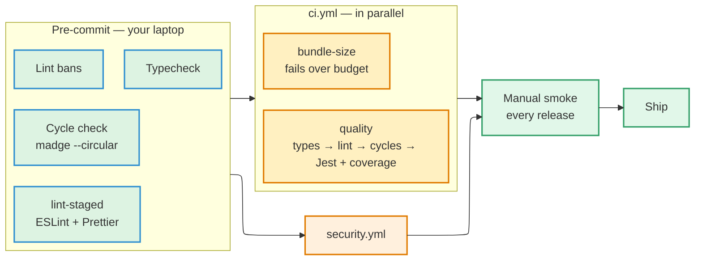

# Testing & CI

## Stack

| | |
| --- | --- |
| Runner | Jest with the `jest-expo` preset |
| Component testing | `@testing-library/react-native` |
| Assertions | Jest built-ins plus `@testing-library/jest-native` matchers |
| Performance | Reassure (`npm run test:perf`) |

No Vitest — it is not supported on React Native.

**There is no automated E2E layer.** A Maestro suite existed from May to July 2026
and was retired: one recorded run in its lifetime, flows that had gone stale
against the shipped app, and CI secrets that were never configured. Manual smoke
testing is the integration verification step for every release, binaries included.
The bar for bringing E2E back is specific: *a real bug ships that a flow would
have caught.*

## The two layers

### Unit tests

Pure functions, utilities, and hooks with isolated logic. No rendering.

### Component tests

UI primitives (`src/ui/`) and feature components
(`src/features/<name>/components/`). Render with React Native Testing Library,
interact through queries (`getByRole`, `getByText`), and assert on **what the user
sees**.

- Do not mount full screens with navigation in a component test — that is what
  smoke testing is for.
- Mock network calls at the `fetch` or Supabase-client boundary, **never** inside
  the component under test.

## File location

Tests are co-located with the code under test. There is no top-level `__tests__/`
folder.

```
src/ui/Button.tsx
src/ui/Button.test.tsx

src/features/listings/hooks/useListingFilter.ts
src/features/listings/hooks/useListingFilter.test.ts
```

## What to test — and what not to

**Do test:**

- Logic that can break silently — reducers, sort and filter helpers, formatting,
  validation.
- Component behaviour users depend on — a button calls its handler, a form shows
  an error when a required field is empty, a list renders the expected number of
  rows.

**Do not test:**

- Styling, layout, colours, or specific token values. Those are covered by visual
  review, not by assertions.
- Third-party library internals.
- Trivial getters or one-line passthroughs.

## Conventions

- One `describe` per unit under test; one `it` per behaviour.
- `it` names read as sentences: `it('disables submit when email is empty')`, not
  `it('test 1')`.
- No snapshot tests, unless there is a specific reason documented in the file.

## Test projects

Jest is configured as several named projects, run selectively:

| Project | Covers |
| --- | --- |
| `unit` | `src/**/*.test.ts` in a Node environment |
| `rn` | `src/**/*.test.tsx` and `app/**/*.test.tsx` under `jest-expo` |
| `edge` | Deno edge-function tests |
| `integration` | Opt-in tests that talk to a real Supabase project |

```bash
npm test                    # everything
npm run test:coverage       # unit + rn + edge, with the coverage gate
npm run test:integration    # requires SUPABASE_INTEGRATION_TEST=1
npm run test:perf           # Reassure render-performance measurement
```

## Continuous integration

If a stage above fails, nothing below it runs.



Because there is no automated E2E layer, **manual smoke is the last integration
check before shipping.**


Three workflows. Everything that can block a merge runs on pull requests;
everything slow or stateful runs on a schedule.

| Workflow | Trigger | Blocking? |
| --- | --- | --- |
| `ci.yml` | Every PR and push to `main` | Yes |
| `security.yml` | Every PR and push to `main`, plus weekly | Yes |
| `deps.yml` | Weekly, manual | No — report only |

### `ci.yml`

Jobs run in parallel:

**`quality`** — typecheck → lint bans → ESLint/SonarJS → `madge --circular` →
Jest with the coverage gate. Coverage thresholds live in `package.json`, so
`npm run test:coverage` locally enforces exactly what CI enforces.

**`bundle-size`** — exports the production JS bundle for both platforms and fails
if either exceeds the budget in `.bundle-budget.json`. The bundle is what every
user downloads on first launch and re-downloads on every OTA update, and it is
parsed on the JS thread before the first screen paints. Raising the budget is a
deliberate act with its own command, not a silent drift.

### Coverage floors

| Metric | Floor |
| --- | --- |
| Statements | 80% |
| Branches | 80% |
| Lines | 80% |
| Functions | 75% |

The floors sit **below** the measured values on purpose. The gate is there to
block *regression*, not to block work that has nothing to do with the gap.
`functions` is the one metric under target; the floor is ratcheted up each time it
clears a new band.

:::warning[Worker limits on the coverage step are load-bearing]

`--maxWorkers=2 --workerIdleMemoryLimit=1G` on the coverage step is not tuning.
Unbounded, the `jest-expo` workers thrash memory badly enough that the suite once
ran **64+ minutes without finishing**; bounded, it completes in around 13. If the
coverage job ever hits its timeout, check this first.

:::

## The pre-commit gate

This is a single-developer project that commits directly to `main`, so the
pre-commit hooks are the safety net a PR review and CI would normally provide:

- Typecheck
- Lint bans
- Dependency-cycle check (`madge --circular`)
- `lint-staged` — ESLint `--fix` and Prettier on staged files

Skipping them with `--no-verify` removes the only safety net this workflow has.

## Scenario maps

Each feature's implementation document carries a map of scenario → test. A
dedicated check validates every row of that map against what Jest actually runs,
using the ancestry Jest reports as the oracle:

```bash
npm run check:scenario-map -- <feature>
```

**Why the oracle is Jest and not a grep.** Three earlier versions of this check
each passed a row that was wrong — matching a describe string anywhere in a file
(which passes on a component name), matching it as a real `describe()` call (which
passes when the describe is real but is not that test's parent), and skipping any
row containing a template placeholder (which passed a row whose file, describe, and
test were all invented). One version silently *dropped* a malformed row, which is
precisely the defect the map exists to catch. Only the ancestry Jest reports can
tell a real-but-wrong parent from the right one.

The current check also counts declared rows against parsed rows, resolves
`it.each` templates against their real expansions, and refuses any row bound to a
skipped, todo, or failing test.

It is a full Jest run, so it is not wired into pre-commit. Invoke it when a map
row is added or renamed, or when a test moves between `describe` blocks.
