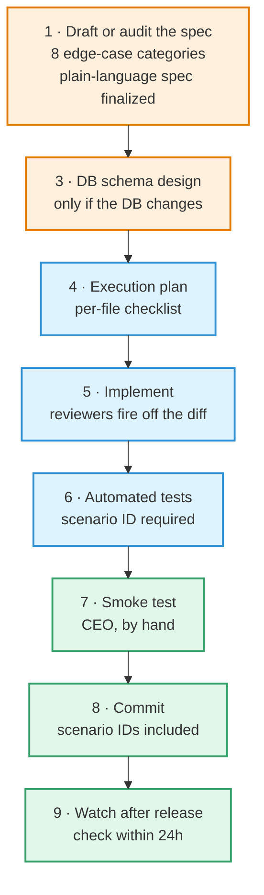
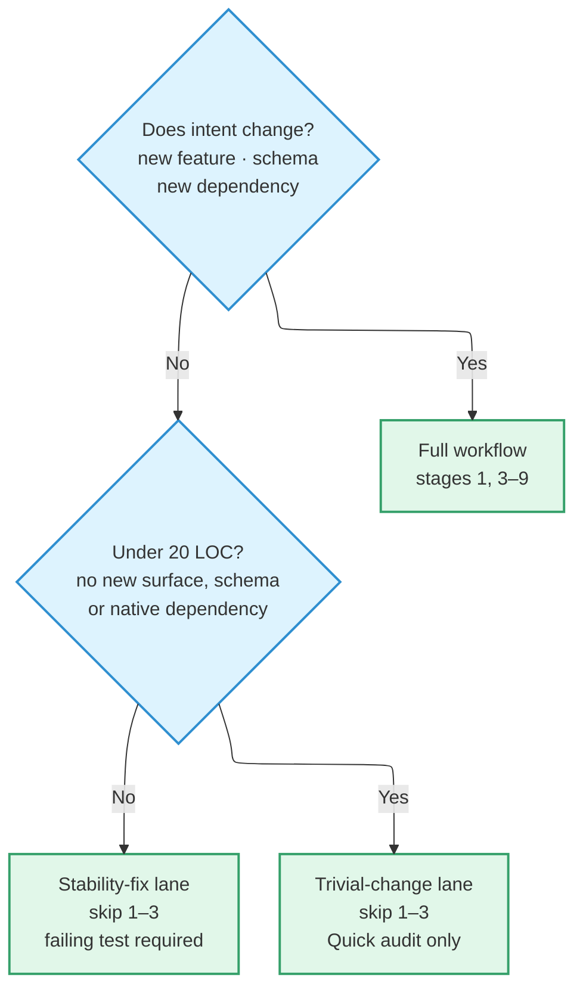

# Development Workflow

This is a solo project. **There is no human peer reviewer.** The whole workflow
exists to fill that gap.

One mechanism carries most of the weight: every code change passes an audit by a
**different model** before it is committed.

## Two roles

| Role | Owns |
| --- | --- |
| **CEO** | Intent, scope, and lane. Signs off the plain-language spec and runs the smoke test personally |
| **Tech Lead** | Turning that intent into code. Judgement comes from the cross-model audit; mechanical rule enforcement comes from subagents |

**Separating judgement from rule enforcement is the point.** Subagent reviewers
only check what can be checked mechanically. "There is a better pattern here" is
a judgement call, and that belongs to the cross-model audit.

## Nine stages

:::warning[Do not reorder stages]

**Do not advance until the current stage's artifact exists.** Skipping requires
explicitly picking one of the two lanes below.

:::

There is no stage 2. It was a separate spec-finalisation step, folded into
stage 1 at the 2026-08 inspection.

**At stage 7 the CEO reads only the plain-language spec** — never the
implementation file. That is what makes the smoke test check *does it do what was
intended*, rather than *does it do what was built*.

## The cross-model audit

> **Every code change passes a different-model audit before commit.** No lane
> exemption, no surface exemption.

Skipping because "the change is small" or "it's only UI" is false economy:
**model bias and context bias are precisely the failure modes this prevents.**

Audit strength scales with the change. Full review on the standard lanes,
BLOCKING-only on the trivial lane. Pure documentation, comment-only, and
formatting-only changes are exempt.

### Three severities

| Class | What | How it is handled |
| --- | --- | --- |
| **BLOCKING** | Security or data loss, spec violation, race condition, outright logic error | Must be answered — accept and fix, or dispute and escalate. **The only class that can produce a request-changes verdict** |
| **STRONG** | A better pattern exists, maintenance concern, standards deviation that is not a defect | Accept, or rebut with the reason stated ("this project keeps pattern X for consistency"). No agreement escalates |
| **ADVISORY** | Style, naming, small improvements | Tech Lead decides. Adopting is fine, passing is fine |

When the two disagree, it goes to the CEO **with both arguments** — plus the
three things needed to decide: **is there a user-visible outcome, is there a
cost or maintenance impact, is there a security trade-off.** The CEO's decision
is final, and **the reasoning is recorded in the feature's decision history
regardless of which side won.**

### Audits are bounded

:::danger[Unbounded looping produces noise, not signal]

Audit rounds have **hard caps** — two at stage 1, three at stages 3–6. At the cap
the gate refuses to run and the open findings route to the CEO for a per-item
decision. Once decided, one confirmation round is sanctioned.

There is evidence behind this. Across the 2026-08 period, **200 of 236 gate runs
were request-changes** under unbounded looping, and **the late rounds were
flagging prose, not defects.** The signal is in the first pass.

:::

The cap bounds **iteration, not the audit itself.** Every change still passes its
cross-model audit.

## Three lanes

Each change picks one. The Tech Lead infers the lane and **the CEO confirms it**
— it is never silently changed mid-flow.

**The stability-fix lane requires a failing test.** Write it *before* the fix,
confirm it fails against the broken code, then fix it and watch it go green. This
lane's audit closed a prior gap where UI and feature stability fixes shipped
without cross-model review.

:::note[A signal that the lane is wrong]

If the trivial lane's Quick audit surfaces non-trivial concerns, **the lane
choice was wrong.** Surface it to the CEO and reclassify.

:::

## The two-file spec model

A feature has at most two documents. **Different readers, therefore different
language.**

| | `<name>.md` | `<name>-implementation.md` |
| --- | --- | --- |
| Domain | **CEO** | **Manager** |
| Holds | Happy path, edge-case behaviour, scenario classification, smoke procedures | Routing tables, component map, store keys, RLS policies, the scenario → test map, [state coordination invariants](./state-coordination.md) |
| Read by | The CEO, **end to end**, at smoke time | Tech Lead and reviewers |
| Exists | Always | **Optional — absence is the default** |

**The CEO spec is the canonical source of truth.** The implementation file is a
working notebook.

### No tech terms in the CEO spec

Hook names, store names, router APIs, RPC / function / table / column names,
payload shapes, file paths, migration timestamps, SDK error types, library names,
test file paths — **all forbidden.**

:::tip[The shape test]

**If a non-engineer reading the sentence aloud would stumble, the sentence
belongs in the implementation file.**

Translate to outcome, not mechanism. Not "the RPC returns only
`{state, reason, dormancy_required}`" but **"nothing about the user reaches the
device before the gate is passed."**

:::

### The implementation file defaults to not existing

Create it only when there is content that must outlive the session: state
coordination invariants, the scenario → test map, or an audit-delta ledger. A
feature with none of those gets no implementation file, and that is **normal
rather than an omission.**

Audit-delta ledgers belong **in the implementation file, never the CEO spec**. By
definition they track how the code matches the spec, which makes them manager
domain. The CEO spec records intent and behaviour; the implementation file records
how the code currently honours that intent.

## Keeping spec and reality together

The failure this workflow is built against is **code changing while the document
does not follow.**

| When this changes | Fix this, in the same commit |
| --- | --- |
| User-visible behaviour | `docs/features/<name>.md` |
| A state coordination invariant | `<name>-implementation.md` |

**"In the same commit" is the whole rule.** Writing it up later means not writing
it up.

Every test carries a comment naming the scenario it verifies
(`// Verifies scenario X.Y`). That comment is the canonical binding between
scenario and test; the implementation file's map is a human-facing convenience
copy. Whether the map still matches reality is
[checked mechanically](./testing-and-ci.md#scenario-maps).

## Related

- Commit format → [Conventions](./conventions.md#commits)
- What blocks a merge → [Testing & CI](./testing-and-ci.md)
- How a release reaches users → [Environments & Releases](./environments-and-releases.md#which-lane-does-a-change-ship-in)
