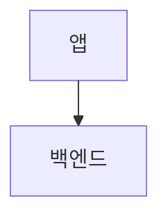

# 문서 작성

## 페이지 추가하기

`docs/` 아래에 마크다운 파일을 만듭니다. 사이드바는 폴더 구조에서 자동으로 생성되므로,
설정을 고치지 않아도 페이지가 내비게이션에 나타납니다.

```md title="docs/guides/checkout.md"
---
sidebar_position: 1
title: 결제
---

# 결제

내용을 여기에 씁니다.
```

이 파일은 `/guides/checkout` 경로로 제공됩니다.

:::note[페이지는 두 언어에 함께 추가하세요]

이 사이트는 영어와 한국어를 제공합니다. 영어 페이지를 추가했다면 한국어 대응 파일을
`i18n/ko/docusaurus-plugin-content-docs/current/` 아래 같은 경로에 만드세요. 상대
링크는 로케일 트리 안에서 해결되므로, 대응 파일이 없으면 그 페이지를 가리키는 링크
때문에 한국어 빌드가 실패합니다.

:::

## 프런트매터

| 항목 | 용도 |
| --- | --- |
| `title` | 페이지 제목. 사이드바와 `<title>` 태그에 쓰입니다 |
| `sidebar_position` | 폴더 안에서의 순서, 오름차순 |
| `slug` | URL 경로 재정의 (`slug: /`는 그 페이지를 사이트 루트로 만듭니다) |
| `description` | 검색 엔진과 링크 미리보기에 쓰이는 설명 |

## 페이지 묶기

폴더는 사이드바 분류가 됩니다. 안에 `_category_.json`을 두어 이름과 순서를 정합니다.

```json title="docs/guides/_category_.json"
{
  "label": "Guides",
  "position": 3
}
```

한국어 분류 이름은 이 파일이 아니라
`i18n/ko/docusaurus-plugin-content-docs/current.json`에 들어갑니다.

## 링크

페이지 사이의 링크는 확장자를 포함한 상대 경로로 씁니다.

```md
[설치](./installation.md)를 보세요.
```

Docusaurus는 빌드 시점에 이것을 최종 URL로 바꾸고, 대상이 없으면 빌드를 실패시킵니다.
그래서 빌드가 통과했다는 것은 죽은 내부 링크가 없다는 뜻입니다.

## 이미지

이미지는 `static/img/`에 넣고 사이트 루트 기준으로 참조합니다.

```md

```

## 코드 블록

강조를 위해 언어를 표시하고, 필요하면 제목도 답니다.

````md
```ts title="example.ts"
export const greet = (name: string) => `Hello, ${name}`;
```
````

## 안내 상자

Docusaurus 3은 제목에 대괄호를 씁니다. `:::note 제목` 형태는 파싱되지 않고 본문에 그대로
찍히므로 주의하세요.

```md
:::warning[꼭 확인하세요]

경고 내용.

:::
```

`note`, `tip`, `info`, `warning`, `danger`를 쓸 수 있습니다. 제목이 필요 없으면
`:::warning`처럼 그냥 두면 됩니다.

## 다이어그램

다이어그램은 코드로 작성합니다. ` ```mermaid ` 코드 펜스가 그대로 그림으로 렌더링되므로,
다른 소스와 마찬가지로 리뷰에서 diff로 볼 수 있습니다.

````md

````

몇 가지 규칙이 있습니다.

- **첫 줄에 `%%{init: {"layout": "elk"}}%%`를 넣으세요.** 기본 레이아웃 엔진은 선이
  서로 겹치는 것을 신경 쓰지 않지만, ELK는 교차를 최소화하고 선을 직각으로 정리합니다.
  순서가 정해져 있는 시퀀스 다이어그램에는 필요 없습니다.
- **색은 `classDef`로 넣습니다.** 색상은 테두리(`stroke`)가 담당하고 배경은 반투명
  틴트만 씁니다. 그래야 밝은 화면과 어두운 화면 양쪽에서 글자가 읽힙니다. `classDef`에
  `color:`로 글자색을 지정하지 마세요. 다크 모드에서 밝은 글자가 밝은 배경 위에 놓이게
  됩니다.

기존 다이어그램의 `classDef` 줄을 그대로 복사해 쓰면 색 체계가 일관되게 유지됩니다.
